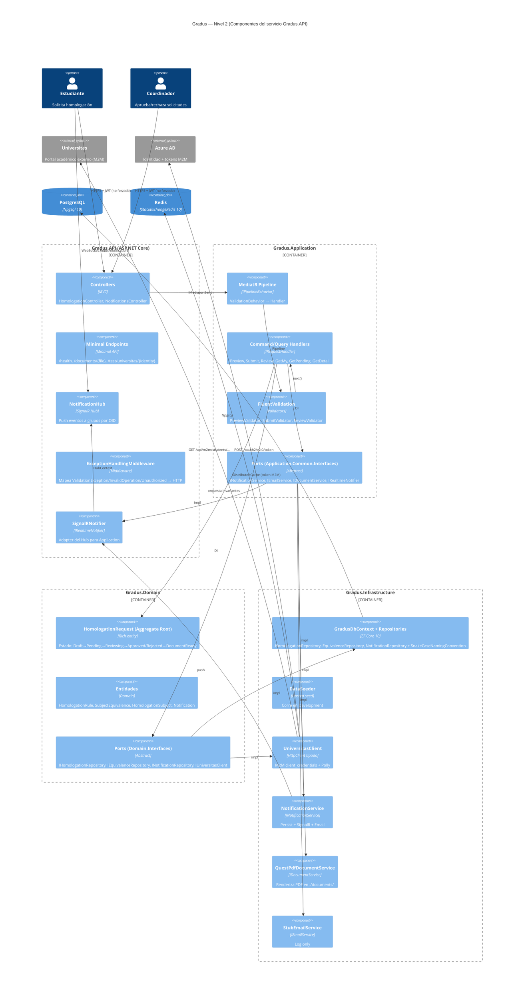

# Gradus — Arquitectura

> Auditoría arquitectónica rigurosa basada en evidencia de código. Cada afirmación cita archivo y línea. Donde el código es ambiguo, la sección **Zonas grises** hace explícito el supuesto.

---

## 1. Evaluación global

La solución declara 4 proyectos en `Gradus.slnx` (L2-L5) organizados como **Clean Architecture en 4 capas**:

```
Gradus.Domain      ← núcleo, sin dependencias externas
Gradus.Application ← casos de uso (CQRS + MediatR), depende solo de Domain
Gradus.Infrastructure ← adaptadores (EF Core, Redis, HTTP, QuestPDF), depende de Application + Domain
Gradus.API         ← host web, depende de los 3 anteriores
```

La dirección de dependencias es coherente con la **Regla de Dependencia** de Uncle Bob (las capas externas conocen a las internas; el núcleo no conoce a nadie). Esto se verifica en los `.csproj`:

| Proyecto | Referencias de proyecto | `.csproj` |
|----------|-------------------------|-----------|
| `Gradus.Domain` | *(ninguna)* | `Gradus.Domain.csproj` |
| `Gradus.Application` | → `Domain` | `Gradus.Application.csproj:3` |
| `Gradus.Infrastructure` | → `Application`, `Domain` | `Gradus.Infrastructure.csproj:3-4` |
| `Gradus.API` | → `Application`, `Infrastructure`, `Domain` | `Gradus.API.csproj:26-28` |

**Veredicto preliminar:** la topología es correcta. Las violaciones detectadas son **internas** (a nivel de contenido de cada capa, no del grafo de proyectos) y se detallan en §3.

---

## 2. Diagrama C4 — Nivel 2 (Componentes)



> El diagrama diferencia **puertos de dominio** (`Domain.Interfaces`) de **puertos de aplicación** (`Application.Common.Interfaces`) — ambos implementados por adaptadores en `Infrastructure` (excepto `IRealtimeNotifier`, implementado en `API` por `SignalRNotifier.cs`).

---

## 3. Alineación con Clean Architecture / Hexagonal / VSA

### 3.1 Clean Architecture — cumplimientos

| Regla | Estado | Evidencia |
|-------|:-:|-----------|
| Dominio sin referencias a frameworks | 🟡 | `Gradus.Domain.csproj` no tiene `PackageReference`. **Pero** `IUniversitasClient.cs:37-96` define DTOs (`StudentProfileDto`, `StudentHistoryDto`, `SubjectRecordDto`, …) que son el contrato de un **sistema externo** — ver violación §3.3-V1. |
| Dependencias apuntan hacia adentro | ✅ | Grafo de `ProjectReference` (§1) |
| Entidades con invariantes y factory methods | ✅ | `HomologationRequest.cs:56-192` (`CreateDraft`, `Submit`, `StartReview`, `Approve`, `Reject`, `SetDocumentReady`, `OverrideSubject`); `HomologationRule.cs:52-93` |
| Casos de uso aislados del transporte | ✅ | `PreviewHomologationHandler.cs` no conoce `HttpContext`, `ControllerBase` ni `JsonSerializer` |
| UI plugable | 🟡 | Controllers + Minimal API conviven en el mismo host — OK, pero `/documents/{fileName}` y `/test/universitas/{identity}` hacen bypass del pipeline MediatR (`Program.cs:143-168`) |

### 3.2 Alineación Hexagonal (Ports & Adapters)

| Puerto | Ubicación | Adaptador | Ubicación |
|--------|-----------|-----------|-----------|
| `IHomologationRepository` | `Gradus.Domain/Interfaces` | `HomologationRepository` | `Gradus.Infrastructure/Persistence/Repositories` |
| `IEquivalenceRepository` | `Gradus.Domain/Interfaces` | `EquivalenceRepository` | idem |
| `INotificationRepository` | `Gradus.Domain/Interfaces` | `NotificationRepository` | idem |
| `IUniversitasClient` | `Gradus.Domain/Interfaces` | `UniversitasClient` | `Gradus.Infrastructure/ExternalServices` |
| `INotificationService` | `Gradus.Application/Common/Interfaces` | `NotificationService` **+** `StubNotificationService` | `Gradus.Infrastructure/Notifications` |
| `IEmailService` | `Gradus.Application/Common/Interfaces` | `StubEmailService` | `Gradus.Infrastructure/Notifications` |
| `IDocumentService` | `Gradus.Application/Common/Interfaces` | `QuestPdfDocumentService` **+** `StubDocumentService` | `Gradus.Infrastructure/Documents` |
| `IRealtimeNotifier` | `Gradus.Application/Common/Interfaces` | `SignalRNotifier` | `Gradus.API/Services` |

**Observación:** dos puertos tienen **dos adaptadores** compilados (`StubNotificationService`, `StubDocumentService`) pero `DependencyInjection.cs:80-82` registra solo las implementaciones reales. Los stubs son código vivo sin consumidor — candidato a remoción o a mover a un proyecto de tests. Ver `improvements.md` §Deuda técnica.

### 3.3 Violaciones detectadas

**V-1. Contratos de sistema externo filtrados al Domain**

`Gradus.Domain/Interfaces/IUniversitasClient.cs:37-96` declara, en la misma unidad de compilación, la interfaz `IUniversitasClient` **y** los DTOs de respuesta (`StudentProfileDto`, `StudentHistoryDto`, `SubjectRecordDto`, `ProgramDto`, `PensumDto`, `InstitutionDto`, `SubjectCountsDto`, `StudentProgressDto`). Estos records son el **contrato de serialización** de Universitas — un sistema externo — y contienen lógica de parsing específica de Prisma (`FinalGradeDecimal`, L87-95: `"Prisma serializa Decimal como string"`). El Domain no debería saber que Universitas usa Prisma.

**Impacto:** un cambio en el JSON de Universitas fuerza recompilar el Domain. El principio de dependencia invertida se rompe de forma semántica (aunque el grafo de proyectos siga correcto).

**Refactor propuesto:**

```csharp
// Domain/Interfaces/IUniversitasClient.cs — solo el contrato abstracto del dominio
public interface IUniversitasClient
{
    Task<StudentSnapshot?> GetStudentAsync(string identity, CancellationToken ct = default);
    Task<SubjectHistory?> GetHistoryAsync(string identity, CancellationToken ct = default);
}

// Domain/ValueObjects/StudentSnapshot.cs — modelo propio de dominio, estable
public sealed record StudentSnapshot(
    string Identity, string FullName, string StudentCode,
    string Campus, ProgramRef Program, InstitutionRef Institution);

public sealed record SubjectHistory(
    string Identity, IReadOnlyList<SubjectRecord> Subjects);

public sealed record SubjectRecord(
    string Code, string Name, int Credits, string Area,
    decimal? FinalGrade, SubjectOutcome Outcome);

public enum SubjectOutcome { Passed, InProgress, Failed, Withdrawn }
```

```csharp
// Infrastructure/ExternalServices/UniversitasDtos.cs — DTOs de wire + mapper
internal sealed record UniversitasProfileDto(string identity, string firstName, …);
internal sealed record UniversitasSubjectDto(string code, string name, string status, string? finalGrade, …)
{
    public SubjectRecord ToDomain() => new(
        Code: code,
        Name: name,
        Credits: credits,
        Area: area,
        FinalGrade: ParseGrade(finalGrade),
        Outcome: status switch
        {
            "PASSED"      => SubjectOutcome.Passed,
            "IN_PROGRESS" => SubjectOutcome.InProgress,
            "FAILED"      => SubjectOutcome.Failed,
            "WITHDRAWN"   => SubjectOutcome.Withdrawn,
            _             => throw new InvalidOperationException($"Unknown status '{status}'")
        });
}
```

Con esto desaparece la comparación mágica `subject.Status != "PASSED"` (`PreviewHomologationHandler.cs:142`) y el `switch` de `OrderByDescending` con strings (L112-115).

**V-2. La capa Application referencia `Microsoft.Extensions.Http`**

`Gradus.Application.csproj:13` declara `<PackageReference Include="Microsoft.Extensions.Http" Version="10.0.6" />`. El proyecto Application **no** usa `HttpClient` — un `grep` del código fuente de Application no encuentra ninguna referencia. El paquete es un artefacto muerto que expone `HttpClient` como superficie disponible a handlers que no deberían tenerla.

**Fix:** eliminar la línea del `.csproj`. Cero cambios de código.

**V-3. Un adaptador (SignalRNotifier) vive en la capa de host**

`Gradus.API/Services/SignalRNotifier.cs` implementa el puerto `IRealtimeNotifier` (`Application.Common.Interfaces`) y se registra desde `Program.cs:100`. Esto es **intencional y defendible** (SignalR tiene acoplamiento al pipeline HTTP de ASP.NET), pero es una excepción a la regla "todos los adaptadores en Infrastructure". La decisión se acepta; documentarla en `CLAUDE.md` o en un comentario de `IRealtimeNotifier.cs` evita que alguien más la considere un error y la "corrija" mal.

**V-4. Saltos sobre MediatR desde el API**

`NotificationsController.cs:24-93` inyecta directamente `INotificationRepository` y llama `_repository.GetUnreadByRecipientAsync(...)`, `_repository.MarkAsReadAsync(...)`, `_repository.SaveChangesAsync(ct)`. No hay handler ni validator. La capa Application es saltada por completo para el dominio de notificaciones.

**Impacto:**
- Validación inexistente (FluentValidation no corre).
- `ValidationBehavior` no aplica.
- La lógica "marcar todas como leídas" vive en SQL ad-hoc sin invariante de dominio. `Notification.MarkAsRead()` (`Notification.cs:53-58`) existe pero no se invoca.
- Inconsistencia con el resto del servicio (homologaciones van por MediatR, notificaciones no).

**Refactor:** crear `Application/Queries/GetUnreadNotifications`, `Application/Commands/MarkNotificationRead`, `Application/Commands/MarkAllNotificationsRead`. Mover la lógica, mantener el repositorio como puerto consumido por el handler.

**V-5. Acceso a filesystem desde `Program.cs` (fuera de capa)**

`Program.cs:143-153` registra un endpoint minimal que hace `Path.Combine(Directory.GetCurrentDirectory(), "documents", fileName)` y `File.Exists` — operaciones de **infraestructura** ejecutadas en la capa host. Debe moverse a un servicio en Infrastructure (`IDocumentStorage.GetStreamAsync`) consumido desde un endpoint que al menos valide/autentique. Adicional, path traversal documentado en `README.md` §C-03 y `vulnerabilities.md` §API-09.

### 3.4 ¿Vertical Slice Architecture?

La estructura `Application/Commands/PreviewHomologation/{Command, Handler, Validator}` y `Application/Queries/GetPendingRequests/{Query, Handler}` sigue **el espíritu de VSA**: cada caso de uso es una carpeta autocontenida con su request, handler y validator. **Pero** no es VSA pura — aún existe capa Domain compartida y capa Infrastructure cruzando todos los slices. La mezcla es razonable: VSA intra-Application, Clean Arch inter-proyectos. Recomendación: mantener.

---

## 4. Auditoría SOLID

### 4.1 SRP — Single Responsibility Principle

🔴 **Violación grave — `PreviewHomologationHandler`** (`PreviewHomologationHandler.cs`, 436 líneas, un solo método `Handle` de ~385 líneas).

Responsabilidades encadenadas en un único método:

| # | Responsabilidad | Líneas |
|---|-----------------|--------|
| 1 | Fetch profile + history desde Universitas | 42-52 |
| 2 | Validar "no mismo programa" | 57-62 |
| 3 | Detectar duplicados activos | 64-76 |
| 4 | Cargar regla + equivalencias | 79-104 |
| 5 | Deduplicar historial (best-of-N) | 109-126 |
| 6 | Evaluar cada materia contra 3-4 reglas | 138-231 |
| 7 | Aplicar límite de créditos | 234-290 |
| 8 | Persistir Draft con subjects | 299-356 |
| 9 | Armar DTO de respuesta | 361-416 |
| 10 | Mapear `RejectionReason` a texto | 419-434 |

**Refactor propuesto:** extraer un **servicio de dominio** `HomologationEvaluator` (`Domain/Services/HomologationEvaluator.cs`) que tome `(StudentSnapshot, SubjectHistory, HomologationRule, IReadOnlyList<SubjectEquivalence>)` y devuelva `HomologationEvaluationResult` (puro, sin I/O). El handler queda en ≤80 líneas: orquesta I/O, llama al evaluator, persiste.

```csharp
// Domain/Services/HomologationEvaluator.cs
public sealed class HomologationEvaluator
{
    public HomologationEvaluationResult Evaluate(
        SubjectHistory history,
        HomologationRule rule,
        IReadOnlyList<SubjectEquivalence> equivalences)
    {
        var best = DeduplicateBestAttempt(history);
        var (homologable, rejected) = EvaluateSubjects(best, rule, equivalences);
        return ApplyCreditsCap(homologable, rejected, rule, equivalences);
    }
    // 3 métodos privados puros, testeables sin mocks
}
```

🟡 **Violación media — `ReviewHomologationHandler`** (`ReviewHomologationHandler.cs`, 153 líneas).

Concatena: orquestación de estado (`StartReview` + `Approve`/`Reject`), generación de PDF, notificaciones. Además hace **4 `SaveChangesAsync`** en el camino feliz (L47, 68, 86, 127) — ver `failures.md` §F-Transacción.

🟢 **Bueno** — entidades del dominio (`HomologationRequest`, `HomologationRule`, `SubjectEquivalence`, `Notification`) respetan SRP: cada una encapsula invariantes de su propio agregado con factory + métodos de transición.

### 4.2 OCP — Open/Closed Principle

🟡 **Violación menor — `GetRejectionDescription`** (`PreviewHomologationHandler.cs:419-434`): `switch` exhaustivo sobre `RejectionReason`. Agregar un nuevo motivo obliga a editar el handler. **Fix:** mover a `RejectionReason` como extensión o a un `IReadOnlyDictionary<RejectionReason, Func<RuleSummary, string>>` en `Domain/Rejection/RejectionMessages.cs`.

🟡 **Violación menor — `NotificationService.ShouldSendEmail`** (`NotificationService.cs:115-122`): hardcodea qué tipos disparan email. Candidato a tabla de configuración o a propiedad en `NotificationType` enum (vía atributo o metadata).

🟢 **Bueno** — `ValidationBehavior<TRequest, TResponse>` (`ValidationBehavior.cs:12`): genérico, agrega nuevas validaciones sin modificar el pipeline, solo registrando nuevos `IValidator<T>`.

### 4.3 LSP — Liskov Substitution

🟡 **Señal de humo — `HomologationRepository.UpdateAsync`** (`HomologationRepository.cs:83-87`):

```csharp
public Task UpdateAsync(HomologationRequest request, CancellationToken ct = default)
{
    _db.HomologationRequests.Update(request);
    return Task.CompletedTask;
}
```

El método es síncrono envuelto en `Task.CompletedTask` — el contrato `Task` es respetado, pero rompe expectativas de async real (un test que use `await Task.WhenAll(UpdateAsync(a), UpdateAsync(b))` no obtiene paralelismo). No es LSP estricto, pero es deshonestidad de la firma. **Fix:** cambiar el puerto a `void Update(...)` (EF Core no requiere async para `Update` — solo `SaveChanges`).

🟢 Las subclases `NotificationService` vs `StubNotificationService` cumplen contrato `INotificationService` (aunque el stub no persiste, el contrato de "Notify" no garantiza persistencia).

### 4.4 ISP — Interface Segregation

🔴 **Violación — puertos de repositorio mezclan lectura + escritura + `SaveChangesAsync`.**

`IHomologationRepository.cs:6-38` expone simultáneamente:
- Lecturas: `GetByIdAsync`, `GetByIdWithSubjectsAsync`, `GetByStudentIdentityAsync`, `GetByStatusAsync`, `HasActiveRequestAsync`
- Escrituras: `AddAsync`, `UpdateAsync`
- Coordinación transaccional: `SaveChangesAsync`

Un handler de query (`GetPendingRequestsHandler.cs`) solo necesita lectura, pero inyecta la interfaz completa. Más grave: **cada repositorio expone su propio `SaveChangesAsync`** (repetido en los 3 repos), lo que empuja a los handlers a elegir cuál llamar → multiples saves por caso de uso → no hay Unit of Work (§5.2).

**Refactor propuesto (segregación + UoW explícito):**

```csharp
// Domain/Interfaces/IHomologationReader.cs
public interface IHomologationReader
{
    Task<HomologationRequest?> GetByIdAsync(Guid id, CancellationToken ct = default);
    Task<HomologationRequest?> GetByIdWithSubjectsAsync(Guid id, CancellationToken ct = default);
    Task<IReadOnlyList<HomologationRequest>> GetByStudentIdentityAsync(string studentIdentity, CancellationToken ct = default);
    Task<IReadOnlyList<HomologationRequest>> GetByStatusAsync(HomologationStatus status, CancellationToken ct = default);
    Task<bool> HasActiveRequestAsync(string studentIdentity, string source, string target, CancellationToken ct = default);
}

// Domain/Interfaces/IHomologationWriter.cs
public interface IHomologationWriter
{
    void Add(HomologationRequest request);
    void Update(HomologationRequest request);
}

// Domain/Interfaces/IUnitOfWork.cs
public interface IUnitOfWork
{
    Task<int> SaveChangesAsync(CancellationToken ct = default);
    Task ExecuteInTransactionAsync(Func<CancellationToken, Task> work, CancellationToken ct = default);
}
```

### 4.5 DIP — Dependency Inversion

🟢 **Mayormente correcto.** Domain define sus puertos, Infrastructure los implementa. Los handlers dependen de `I*` en todos los casos relevantes.

🟡 **Excepción 1** — `SubmitHomologationHandler.cs:18`:

```csharp
private const string CoordinatorGroupOid = "coordinator-group";
```

Magic string constante hardcodeada. Viola DIP respecto a configuración: el handler depende de una política concreta de identificador de grupo en vez de abstraerla (p.ej. `IRecipientResolver.GetCoordinatorsForProgram(targetCode)`). Ver `failures.md` §lógica.

🟡 **Excepción 2** — `NotificationService.cs:100`:

```csharp
toEmail: $"{recipientAzureOid}@politecnicointernacionaldev.onmicrosoft.com",
```

El dominio del email del tenant está incrustado. Debe venir de `IOptions<EmailOptions>`.

🟡 **Excepción 3** — `QuestPdfDocumentService.cs:20`:

```csharp
_outputDirectory = Path.Combine(Directory.GetCurrentDirectory(), "documents");
Directory.CreateDirectory(_outputDirectory);
```

Dependencia dura contra `Directory.GetCurrentDirectory()` — en producción esto se romperá al montar como container sin write-access al CWD, o al ejecutarse como servicio Windows. Debe recibirse por `IOptions<DocumentStorageOptions>` y ofrecer una abstracción `IDocumentStorage` (filesystem / Azure Blob / S3) — ver `improvements.md` §Deuda técnica.

---

## 5. Patrones detectados — con crítica

### 5.1 Mediator + CQRS

**Presente.** `Application` separa:

- **Commands** (`Commands/PreviewHomologation/`, `Commands/SubmitHomologation/`, `Commands/ReviewHomologation/`) — tienen efectos, devuelven un resumen tras la mutación.
- **Queries** (`Queries/GetMyRequests/`, `Queries/GetPendingRequests/`, `Queries/GetRequestDetail/`) — puras de lectura.

Todo pasa por `IMediator.Send` desde `HomologationController.cs`. El pipeline está extendido con `ValidationBehavior<,>` (`DependencyInjection.cs:26`).

**Crítica:**
- CQRS aquí es **lógico**, no físico: ambos lados usan `GradusDbContext` y repositorios con tracking. Para CQRS real, las queries deberían usar `AsNoTracking()` + proyecciones + SQL crudo o vistas. Ninguna query hace `.AsNoTracking()` (ver `improvements.md` §Performance).
- No hay separación de modelos de lectura/escritura: los handlers de query construyen DTOs a partir de agregados cargados completos. Para `GetPendingRequestsHandler` (L33-47) se cargan todas las `HomologationRequest` sin `Include(r => r.Subjects)` pero tampoco sin `AsNoTracking` — EF rastrea instancias que nadie modifica.
- `NotificationsController` **rompe el patrón** saltando Mediator directamente al repositorio (V-4).

### 5.2 Repository + ¿Unit of Work?

**Repository: presente.** Tres repos concretos (`HomologationRepository`, `EquivalenceRepository`, `NotificationRepository`) sobre `GradusDbContext`.

**Unit of Work: ausente.** Cada repositorio expone `SaveChangesAsync` (`IHomologationRepository.cs:37`, `IEquivalenceRepository.cs:29`, `INotificationRepository.cs:25`) y lo implementa llamando `_db.SaveChangesAsync`. Dado que los 3 repos comparten el mismo `DbContext` (registrado `Scoped` en `DependencyInjection.cs:27`), **todas las llamadas `SaveChangesAsync` operan sobre la misma unidad de trabajo física** — pero el diseño no lo comunica.

**Consecuencia observable — `ReviewHomologationHandler.cs`:**

| Línea | Operación | Save |
|-------|-----------|:-:|
| 44 | `request.StartReview(...)` | — |
| 45-46 | `UpdateAsync` + `SaveChangesAsync` | ✅ #1 |
| 52-60 | `request.OverrideSubject(...)` (loop) | — |
| 66 | `request.Approve(...)` | — |
| 67-68 | `UpdateAsync` + `SaveChangesAsync` | ✅ #2 |
| 79-84 | `GenerateDocument` + `request.SetDocumentReady` | — |
| 85-86 | `UpdateAsync` + `SaveChangesAsync` | ✅ #3 |
| 103 | `_notifications.NotifyAsync` → internamente `NotificationService.cs:54` | ✅ #4 |

**4 `SaveChangesAsync` en un solo caso de uso**, sin `IDbContextTransaction`. Si el PDF falla después del save #2 pero antes del #3, el estado queda `Approved` pero sin `DocumentUrl` (ruta de recuperación existe — `try/catch` L90-100 — pero la inconsistencia de dominio queda persistida). Si la notificación falla, la aprobación ya está commiteada.

**Refactor:** introducir `IUnitOfWork` con `ExecuteInTransactionAsync` que abra `BeginTransactionAsync`, ejecute el callback, y commitee al final. Los repos pierden `SaveChangesAsync` — solo `Add/Update`. Ver `failures.md` §Transacción.

### 5.3 Specification

**Ausente.** Las queries se expresan como lambdas en los repositorios (`HomologationRepository.cs:68-75`). Para el tamaño actual del dominio es aceptable. Candidato a introducir si el número de `HasActiveRequestAsync`-like crece.

### 5.4 Options Pattern

**Presente y correcto.** `UniversitasOptions.cs` con `SectionName = "Universitas"`, registrado vía `Configure<UniversitasOptions>(configuration.GetSection(...))` (`DependencyInjection.cs:64-66`) e inyectado como `IOptions<UniversitasOptions>` en `UniversitasClient.cs:28`. ✅

### 5.5 Rich Domain Model

**Presente.** `HomologationRequest` y `HomologationRule` tienen constructor privado + factory estático + setters privados + validación en factory (`ArgumentException.ThrowIfNullOrWhiteSpace`, rangos para grados, chequeo de programa distinto). Las transiciones de estado protegen invariantes (`HomologationRequest.cs:95-97, 110-118, 130-133, 145-148, 164-167, 181-184, 204-207`). **Bien.**

### 5.6 Result/Either

**Ausente.** El dominio y handlers comunican errores via **excepciones** (`InvalidOperationException`, `UnauthorizedAccessException`, `ArgumentException`). `ExceptionHandlingMiddleware.cs:71-88` las mapea a HTTP 409 / 403 / 400. Funciona, pero excepciones para flujo de negocio es anti-patrón en códigos base grandes (costo de stack unwinding + ruido en tracing). Migración a `Result<T>` es un **Thankless** — ver `improvements.md`.

### 5.7 Pipeline Behavior (Decorator sobre IRequestHandler)

**Presente.** `ValidationBehavior<TRequest, TResponse>` (`ValidationBehavior.cs`). Ejecuta **antes** del handler. Bien diseñado. Candidatos adicionales sugeridos: `LoggingBehavior` (correlation ID + duración), `UnitOfWorkBehavior` (envuelve automáticamente commands en transacción), `AuthorizationBehavior` (policies por request type).

### 5.8 DTO / Records inmutables

`PreviewHomologationCommand.cs:19-72` usa `record` para Command, Response y todos los DTOs anidados — excelente. Lo mismo en todos los commands/queries. ✅

---

## 6. Mapeo exhaustivo de paquetes NuGet

### 6.1 Gradus.API

| Paquete | Versión | Propósito real | Última versión (2026-04) | ¿Necesario? |
|---------|---------|----------------|-------|:-:|
| `FluentValidation.AspNetCore` | `11.3.1` | **NO SE USA** — el proyecto usa `FluentValidation` (sin sufijo AspNetCore) en Application vía pipeline MediatR | deprecated (FV dejó de mantener AspNetCore package en v11) | 🔴 **Eliminar** |
| `MediatR` | `14.1.0` | Mediator — necesario porque `Program.cs:15` lee `MediatR:LicenseKey` y lo pasa a `AddApplication` | `14.1.0` (comercial LuckyPenny) | ✅ |
| `Microsoft.AspNetCore.Authentication.JwtBearer` | `10.0.7` | JWT Bearer configurado en `Program.cs:55-76` contra Azure AD | 10.0.7 | ✅ |
| `Microsoft.AspNetCore.OpenApi` | `10.0.6` | Extensión nativa .NET 10 para OpenAPI | 10.0.6 | 🟡 *redundante con Swashbuckle* |
| `Microsoft.EntityFrameworkCore` | `10.0.6` | EF Core — **usado solo por `Program.cs:111` (`MigrateAsync`)**. El resto vive en Infrastructure | 10.0.6 | 🟡 minimizable a transitivo |
| `Microsoft.EntityFrameworkCore.Design` | `10.0.6` | Migraciones (`dotnet ef migrations add`) — correcto declarar con `PrivateAssets=all` | 10.0.6 | ✅ |
| `Serilog.AspNetCore` | `10.0.0` | **Referenciado pero NO inicializado** en `Program.cs`. No hay `UseSerilog()` ni configuración `Logging:WriteTo`. Serilog nunca arranca — se usa `ILoggerFactory` default | 10.0.0 | 🔴 inicializar o eliminar |
| `Serilog.Sinks.Console` | `6.1.1` | Sink Serilog — inútil mientras Serilog no esté activo | 6.1.1 | 🔴 idem |
| `Swashbuckle.AspNetCore` | `10.1.7` | Swagger UI en `Program.cs:23-52` | 10.1.7 | ✅ (pero ver `improvements.md` §DevEx — preferir `Microsoft.AspNetCore.OpenApi` nativo y eliminar Swashbuckle en .NET 10) |

### 6.2 Gradus.Application

| Paquete | Versión | Propósito real | ¿Necesario? |
|---------|---------|----------------|:-:|
| `FluentValidation` | `12.1.1` | Validadores de commands (`PreviewHomologationValidator.cs:5`) | ✅ |
| `FluentValidation.DependencyInjectionExtensions` | `12.1.1` | `AddValidatorsFromAssembly` en `DependencyInjection.cs:30` | ✅ |
| `MediatR` | `14.1.0` | Interfaces `IRequest`, `IRequestHandler`, `IPipelineBehavior` | ✅ |
| `Microsoft.Extensions.DependencyInjection.Abstractions` | `10.0.6` | `IServiceCollection` en `DependencyInjection.cs` | ✅ |
| `Microsoft.Extensions.Http` | `10.0.6` | **NO SE USA** — grep sin resultados en `Gradus.Application/` | 🔴 **Eliminar** |
| `Microsoft.Extensions.Logging.Abstractions` | `10.0.6` | `ILogger<T>` en handlers | ✅ |

### 6.3 Gradus.Infrastructure

| Paquete | Versión | Propósito real | ¿Necesario? |
|---------|---------|----------------|:-:|
| `Microsoft.AspNetCore.Authentication.JwtBearer` | `10.0.6` | **NO SE USA** — JWT bearer solo se configura en `Program.cs` (API) | 🔴 **Eliminar** |
| `Microsoft.EntityFrameworkCore` | `10.0.6` | `DbContext`, `ToListAsync`, `Include` | ✅ |
| `Microsoft.EntityFrameworkCore.Design` | `10.0.6` | `IDesignTimeDbContextFactory` (implícito) + scaffolding de migraciones | ✅ |
| `Microsoft.Extensions.Caching.StackExchangeRedis` | `10.0.6` | `IDistributedCache` sobre Redis para token M2M | ✅ |
| `Microsoft.Extensions.Configuration.Abstractions` | `10.0.6` | `IConfiguration` en `DependencyInjection.cs` | ✅ |
| `Microsoft.Extensions.Http.Resilience` | `10.5.0` | `AddStandardResilienceHandler` (Polly v8+) en `DependencyInjection.cs:78` | ✅ |
| `Microsoft.Extensions.Options` | `10.0.6` | `IOptions<UniversitasOptions>` | ✅ |
| `Npgsql.EntityFrameworkCore.PostgreSQL` | `10.0.1` | Provider Postgres + `UseNpgsql` | ✅ |
| `QuestPDF` | `2026.2.4` | Renderizado de PDF en `HomologationDocument` | ✅ |

### 6.4 Gradus.Domain

Sin paquetes. ✅ (como debe ser.)

### 6.5 Resumen de acción

| Acción | Paquetes afectados |
|--------|-------------------|
| 🔴 Eliminar (código muerto) | `FluentValidation.AspNetCore` (API), `Microsoft.Extensions.Http` (Application), `Microsoft.AspNetCore.Authentication.JwtBearer` (Infrastructure) |
| 🔴 Inicializar o eliminar | `Serilog.AspNetCore`, `Serilog.Sinks.Console` |
| 🟡 Minimizar a transitivo | `Microsoft.EntityFrameworkCore` en `Gradus.API.csproj` (lo traería Infrastructure) |
| 🟡 Decidir uno u otro | `Swashbuckle.AspNetCore` vs `Microsoft.AspNetCore.OpenApi` |

---

## 7. Análisis de `Program.cs` — pipeline HTTP y DI

### 7.1 Orden del pipeline (ASP.NET Core middleware)

Orden efectivo declarado en `Program.cs`:

```
UseHttpsRedirection  (solo !IsDevelopment)      L125-126
UseCors("GradusFrontend")                       L128
UseMiddleware<ExceptionHandlingMiddleware>      L129
UseAuthentication                               L132
UseAuthorization                                L133
MapControllers                                  L135
MapHub<NotificationHub>                         L136
MapGet /health                                  L139
MapGet /documents/{fileName}                    L143
MapGet /test/universitas/{identity}  (Dev only) L158
```

### 7.2 Problemas de orden

🔴 **P-1. `ExceptionHandlingMiddleware` antes de `UseAuthentication`/`UseAuthorization`.**

Si `UseAuthentication` o `UseAuthorization` lanzan (p.ej. `SecurityTokenExpiredException` en validación de JWT), el middleware sí las captura (va antes en la cadena de `next()`), pero el middleware solo conoce tres tipos (`ValidationException`, `UnauthorizedAccessException`, `InvalidOperationException`) y todo lo demás cae a `catch (Exception)` → HTTP 500 con mensaje genérico. El caller no distingue "token expirado" de "regla de negocio violada". **Fix:** manejar explícitamente `SecurityTokenException`, `AuthenticationFailureException` → 401.

🟡 **P-2. Swagger solo en Development.** `Program.cs:116-122` dentro del `if (app.Environment.IsDevelopment())`. OK para seguridad. Pero `DisplayRequestDuration()` en L121 expuesto sin gate — no es crítico, solo un detalle.

🔴 **P-3. `UseHttpsRedirection` solo fuera de Development** (L125-126). En Dev todo corre HTTP. Dev OK, pero en ausencia de `UseHsts()` en el branch productivo, **no hay HSTS**. Añadir `app.UseHsts()` antes de `UseHttpsRedirection`.

🟡 **P-4. Ausencia de `UseRouting`/`UseEndpoints` explícitos.** En .NET 10 minimal hosting los inserta automáticamente, pero se debe validar que CORS/Auth queden **entre** Routing y Endpoints (fase ASP.NET internaliza esto, está OK — solo mencionar).

🔴 **P-5. Sin RateLimiting.** No hay `app.UseRateLimiter()` — cualquier caller puede enviar 10k `/preview` por minuto. Cubierto en `vulnerabilities.md` §API-04.

🔴 **P-6. Sin Security Headers.** No hay middleware para `X-Content-Type-Options`, `X-Frame-Options`, `Content-Security-Policy`, `Referrer-Policy`. Cubierto en `vulnerabilities.md` §API-08.

🔴 **P-7. Sin ResponseCompression / OutputCache.** Ver `improvements.md` §Performance.

🔴 **P-8. Migraciones + seed awaited en startup** (`Program.cs:109-113`): `await db.Database.MigrateAsync()` y `await seeder.SeedAsync()` en Development. Fuera de Dev no hay migración automática → deploy productivo requiere paso manual documentado (ausente). Mover a `IHostedService` o a un script externo (preferible).

🟡 **P-9. Endpoint de debug `/test/universitas/{identity}`** (L158-167): `[AllowAnonymous]` implícito (minimal API sin `RequireAuthorization`), en Dev. Aceptable en local, crítico si accidentalmente se despliega — añadir `.RequireHost("localhost")` al menos.

### 7.3 Lifetimes de DI

| Servicio | Lifetime registrado | Correcto | Nota |
|----------|---------------------|:-:|------|
| `GradusDbContext` | Scoped (default `AddDbContext`) | ✅ | |
| `IHomologationRepository` → `HomologationRepository` | Scoped (`DI.cs:49`) | ✅ | Comparte DbContext scoped |
| `IEquivalenceRepository` → `EquivalenceRepository` | Scoped (`DI.cs:50`) | ✅ | |
| `INotificationRepository` → `NotificationRepository` | Scoped (`DI.cs:51`) | ✅ | |
| `DataSeeder` | Scoped (`DI.cs:54`) | ✅ | |
| `IDistributedCache` (Redis) | Singleton (implícito en `AddStackExchangeRedisCache`) | ✅ | |
| `IUniversitasClient` → `UniversitasClient` | Transient (implícito en `AddHttpClient<,>`) | ✅ | `HttpClient` gestionado por `IHttpClientFactory` |
| `INotificationService` → `NotificationService` | Scoped (`DI.cs:81`) | ✅ | Consume repo scoped |
| `IEmailService` → `StubEmailService` | Scoped (`DI.cs:80`) | 🟡 | Un email service puede ser singleton. Innecesario scoped. |
| `IDocumentService` → `QuestPdfDocumentService` | Scoped (`DI.cs:82`) | 🟡 | Singleton sería correcto (stateless, solo escribe al disco). |
| `IRealtimeNotifier` → `SignalRNotifier` | Scoped (`Program.cs:100`) | 🟡 | `IHubContext<T>` es singleton; el wrapper puede ser singleton también. |
| `IMediator` / handlers | Transient (default MediatR) | ✅ | |
| `IValidator<T>` | Transient (default FV) | ✅ | |
| `ValidationBehavior<,>` | Transient (registro open generic) | ✅ | |
| `QuestPDF.Settings.License` | **Estado estático global** mutado en `DI.cs:24` | 🟡 | Efecto colateral en arranque — aceptable pero merece comentario |

**Captive dependency check:** ningún singleton consume scoped (OK). El caso límite es `SignalRNotifier` (Scoped) consumiendo `IHubContext` (Singleton) → válido (scoped puede consumir singleton). Invirtiendo a Singleton ahorraría alloc por request.

### 7.4 Registros mal elegidos o faltantes

🔴 **R-1. `StubNotificationService` y `StubDocumentService` no registrados pero existen en binario.**
Código muerto en runtime. Eliminar del proyecto o mover a `Gradus.Tests/Fakes/`.

🔴 **R-2. `IEmailService` solo tiene `StubEmailService`.**
En producción no se envía correo. Si `NotificationService.cs:103` entra en la rama `ShouldSendEmail(type) == true`, el stub loguea y descarta. Registrar un `SmtpEmailService` / `SendGridEmailService` real o documentar explícitamente que email está deshabilitado.

🔴 **R-3. MediatR license key leída como string** (`Program.cs:15`).
El key ya está en texto plano en `appsettings.json` (ver `README.md §C-02`). Mover a `dotnet user-secrets` / Key Vault y leer via `IConfiguration` con sección dedicada.

🟡 **R-4. CORS — `AllowCredentials` con orígenes específicos — correcto.**
`Program.cs:84-97` declara orígenes `http://localhost:3003` y `http://localhost:3004` + `AllowCredentials`. No hay comodín. En producción: añadir los dominios reales de frontend via configuración, no hardcoded.

🟡 **R-5. Swagger `AddSecurityDefinition("bearer", …)`** con nombre en minúsculas.
Swashbuckle v10 acepta, pero el convenio es `"Bearer"` (mayúscula). `Program.cs:37` — cosmético.

---

## 8. Convenciones de proyecto (propiedades MSBuild)

| Propiedad | Valor | Proyectos | Comentario |
|-----------|-------|-----------|------------|
| `TargetFramework` | `net10.0` | los 4 | **Preview en la fecha del análisis** — revisar política de soporte LTS |
| `Nullable` | `enable` | los 4 | ✅ |
| `ImplicitUsings` | `enable` | los 4 | ✅ |
| `TreatWarningsAsErrors` | `true` | los 4 | ✅ Excelente disciplina |
| `UserSecretsId` | `c56c3fff-…` | API solo | ✅ pero no se usa para `MediatR:LicenseKey`, `ConnectionStrings`, `Universitas:ClientSecret` → ver `vulnerabilities.md §API-08` |

**Faltantes recomendados** (ver `improvements.md` §DevEx):
- `Directory.Build.props` raíz con las 4 propiedades compartidas.
- `Directory.Packages.props` con Central Package Management (`ManagePackageVersionsCentrally=true`) para eliminar versiones duplicadas entre proyectos (p.ej. `Microsoft.EntityFrameworkCore` aparece en API e Infrastructure).
- `.editorconfig` con reglas de estilo.
- Analyzers: `Microsoft.CodeAnalysis.NetAnalyzers`, `SonarAnalyzer.CSharp`, `Roslynator`.

---

## 9. Zonas grises

**ZG-1.** `PreviewHomologationHandler.cs:192-215`: la rama `if (rule.RequiresSameArea && subject.Area != equivalence.SourceSubjectCode)` compara `subject.Area` contra `equivalence.SourceSubjectCode` **pero el bloque está vacío** — 17 líneas de comentarios explicando lo que "debería hacer" sin ejecutar nada. Adicionalmente, el operando `SourceSubjectCode` parece error: debería ser un área, no un código. **Supuesto:** el feature de "área requerida" **no está implementado** — el flag `RequiresSameArea` de `HomologationRule` se ignora silenciosamente en preview. Cobertura en `failures.md` §lógica.

**ZG-2.** `PreviewHomologationHandler.cs:234-239`: la expresión `rule.MaxCreditsPercentage / 100.0 * rule.SubjectEquivalences.Count > 0 ? … : double.MaxValue` es **aritméticamente incorrecta** por precedencia: evalúa `(rule.MaxCreditsPercentage / 100.0 * rule.SubjectEquivalences.Count) > 0` como condición. El cálculo real del cap se hace correctamente en L244-246 (`targetTotalCredits = equivalences.Sum(...)`), por lo que L234-239 es código muerto. **Supuesto:** bug latente que no afecta el resultado por el override en L244. Remover L234-239. Cobertura en `failures.md`.

**ZG-3.** `PreviewHomologationHandler.cs:311-315`: `foreach (var s in allSubjects) { // Recrear con el ID correcto de la solicitud }` — loop vacío con comentario. Lógica efectiva está en L318-349 (`finalHomologable`/`finalRejected` recrean subjects). **Supuesto:** fragmento olvidado de refactor, sin efecto.

**ZG-4.** `PreviewHomologationHandler.cs:300-308`: `studentIdentity: command.StudentAzureOid` y `targetProgramName: command.TargetProgramCode`. Se usa el OID de Azure como `StudentIdentity` (el dominio nombra "identidad" y "OID" como campos distintos en `HomologationRequest`), y el **código** del programa destino como **nombre** del programa destino — con comentario `// se completa abajo` que nunca se completa. **Supuesto:** los campos `StudentIdentity` y `TargetProgramName` quedan populados con valores incorrectos en todas las Draft. `documentation.md` y `failures.md` cubren detalle.

**ZG-5.** `SubmitHomologationHandler.cs:18`: `CoordinatorGroupOid = "coordinator-group"` — al no existir un usuario con ese OID, `NotifyAsync` intentará enviar a un grupo SignalR inexistente + persistir una Notification con recipient ficticio. **Supuesto:** placeholder documentado para la feature de asignación de coordinador, pendiente.

**ZG-6.** `HomologationRuleConfiguration.cs` no fue leído en este análisis. **Supuesto:** aplica configuración EF similar a `HomologationRequestConfiguration.cs` (índices por `(SourceProgramCode, TargetProgramCode)`, `HasMany(r => r.SubjectEquivalences)`); documentation.md detallará el esquema.

**ZG-7.** No existe carpeta `Tests/` ni `Gradus.Tests.csproj` en la solución. **Supuesto:** testing intencional pendiente (no un bug del análisis). Ver `improvements.md §Testing`.

---

## 10. Resumen de hallazgos de arquitectura

| ID | Nivel | Área | Resumen |
|----|:-:|------|---------|
| A-01 | 🔴 | Capas | DTOs de Universitas en Domain (`IUniversitasClient.cs:37-96`) |
| A-02 | 🟡 | Capas | `Microsoft.Extensions.Http` declarado en Application sin uso |
| A-03 | 🟡 | Capas | `SignalRNotifier` (adapter) en `Gradus.API` — decisión defendible, documentar |
| A-04 | 🔴 | Capas | `NotificationsController` salta MediatR y consume `INotificationRepository` directamente |
| A-05 | 🔴 | Capas | Endpoint minimal `/documents/{fileName}` hace filesystem I/O desde host |
| A-06 | 🔴 | SRP | `PreviewHomologationHandler` ≥10 responsabilidades en un método de 385 líneas |
| A-07 | 🟡 | SRP | `ReviewHomologationHandler` orquesta estado + PDF + notificaciones con 4 saves |
| A-08 | 🔴 | ISP | Repositorios mezclan lectura + escritura + `SaveChangesAsync` |
| A-09 | 🔴 | UoW | No existe Unit of Work explícito — saves múltiples sin transacción |
| A-10 | 🟡 | DIP | Magic strings hardcodeadas (`"coordinator-group"`, dominio email, `Directory.GetCurrentDirectory()`) |
| A-11 | 🔴 | NuGet | `FluentValidation.AspNetCore`, `Microsoft.Extensions.Http`, `JwtBearer` en Infrastructure — paquetes sin uso |
| A-12 | 🔴 | NuGet | Serilog referenciado pero no inicializado |
| A-13 | 🔴 | Pipeline | Sin HSTS, Rate Limiting, Security Headers, ResponseCompression |
| A-14 | 🟡 | Pipeline | `ExceptionHandlingMiddleware` no maneja excepciones de autenticación JWT |
| A-15 | 🟡 | DI | `IEmailService`, `IDocumentService`, `IRealtimeNotifier` podrían ser Singleton |
| A-16 | 🔴 | Código muerto | `StubNotificationService`, `StubDocumentService` no registrados; bloques L192-215 y L311-315 en Preview vacíos |
| A-17 | 🔴 | Bugs latentes | `RequiresSameArea` ignorado; `StudentIdentity`/`TargetProgramName` mal poblados (ZG-4) |
| A-18 | 🟡 | DevEx | Faltan `Directory.Build.props`, `Directory.Packages.props`, `.editorconfig`, analyzers |

---

## 11. Referencias cruzadas

- Detalle de **seguridad** del endpoint `/documents/{fileName}` y auth ausente → `vulnerabilities.md` §API-01, §API-05, §API-09.
- Detalle de **bugs** en `PreviewHomologationHandler` (ZG-1, ZG-2, ZG-3, ZG-4), `new HttpClient()` manual, múltiples `SaveChangesAsync` sin transacción → `failures.md`.
- **Performance**: falta `AsNoTracking`, paginación en pending, compiled queries → `improvements.md §Performance`.
- **Testing** sobre `HomologationEvaluator` extraído, `HomologationRequest` aggregate, `ValidationBehavior` y `UniversitasClient` con `WebApplicationFactory` + Testcontainers → `improvements.md §Testing`.

---

¿Listo para generar el siguiente archivo (`analysis/vulnerabilities.md`)?
