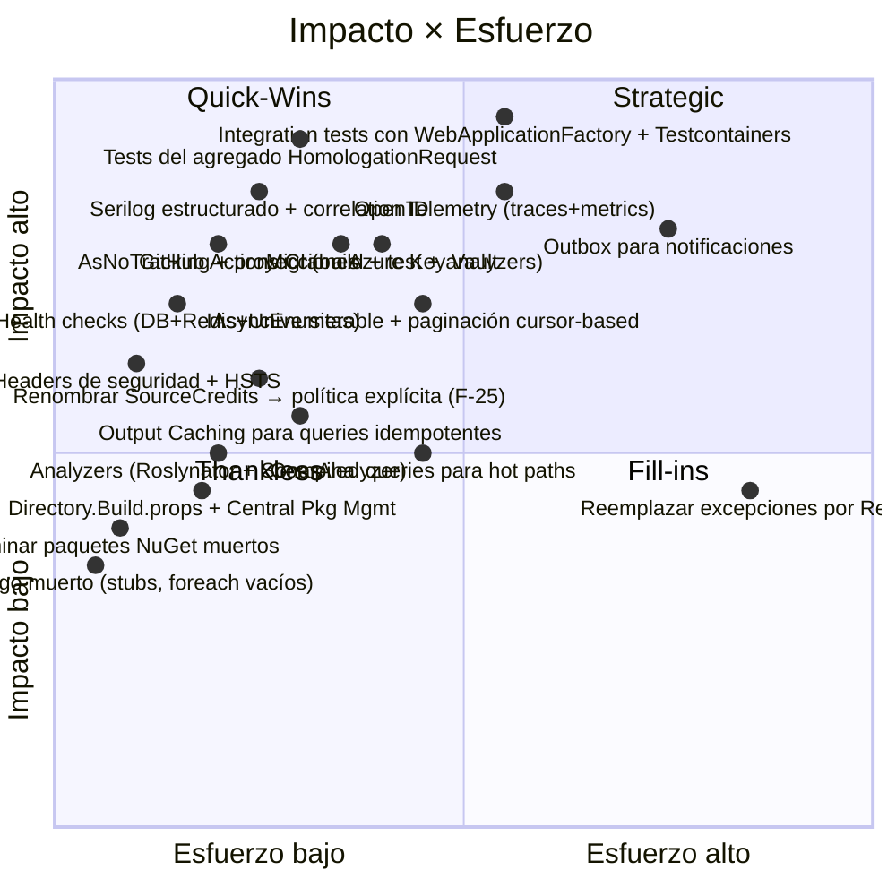

# Gradus — Mejoras Priorizadas

> Catálogo de oportunidades de mejora estructurado por categoría con matriz **Impacto × Esfuerzo**. Cada ítem indica criticidad de adopción, tamaño relativo (S/M/L/XL), referencia cruzada con hallazgos previos y, donde aplica, código compilable de referencia.
>
> **Notación de esfuerzo:** XS (≤2h) · S (≤1d) · M (1-3d) · L (1-2sem) · XL (>2sem).

---

## 1. Matriz Impacto × Esfuerzo



**Lectura:**

| Cuadrante | Política | Items |
|-----------|----------|-------|
| **Quick Wins** (alto impacto / bajo esfuerzo) | Hacer primero | Headers seguridad, eliminar NuGet muerto, eliminar código muerto, tests del agregado, AsNoTracking, health checks, Directory.Build.props, Serilog + correlation ID |
| **Strategic** (alto impacto / alto esfuerzo) | Roadmap trimestral | Integration tests con Testcontainers, OpenTelemetry, Outbox, Key Vault, IAsyncEnumerable + paginación |
| **Fill-ins** (bajo impacto / bajo esfuerzo) | Tiempos muertos | Output Caching, compiled queries, analyzers |
| **Thankless** (bajo impacto / alto esfuerzo) | Rechazar/diferir | Migración a `Result<T>` salvo decisión arquitectónica explícita |

---

## 2. Performance

### 2.1 EF Core — `AsNoTracking` + proyecciones (Quick Win, S)

**Referencia:** `failures.md §F-11`, `architecture.md §5.1`.

Todos los handlers de query rastrean entidades innecesariamente. Convertirlos a proyección directa devuelve resultados con menor allocation y zero tracking overhead.

**Antes** — `GetPendingRequestsHandler.cs:23-47`:

```csharp
var pending = await _requests.GetByStatusAsync(HomologationStatus.Pending, cancellationToken);
var reviewing = await _requests.GetByStatusAsync(HomologationStatus.Reviewing, cancellationToken);
return pending.Concat(reviewing)
    .OrderByDescending(r => r.CreatedAt)
    .Select(r => new PendingRequestDto(...))
    .ToList();
```

**Después** — handler trabaja sobre `IGradusReadDbContext` (interfaz inyectada en Application apuntando a `GradusDbContext`, expuesta solo como `IQueryable`):

```csharp
public sealed class GetPendingRequestsHandler
    : IRequestHandler<GetPendingRequestsQuery, IReadOnlyList<PendingRequestDto>>
{
    private readonly IGradusReadDbContext _db;
    public GetPendingRequestsHandler(IGradusReadDbContext db) => _db = db;

    public async Task<IReadOnlyList<PendingRequestDto>> Handle(
        GetPendingRequestsQuery query, CancellationToken ct)
    {
        return await _db.HomologationRequests
            .AsNoTracking()
            .Where(r => r.Status == HomologationStatus.Pending
                     || r.Status == HomologationStatus.Reviewing)
            .OrderByDescending(r => r.CreatedAt)
            .Select(r => new PendingRequestDto(
                r.Id, r.StudentName, r.StudentCode,
                r.SourceProgramCode, r.TargetProgramCode,
                r.Status.ToString(),
                r.TotalSubjectsApproved, r.TotalCreditsHomologated,
                r.CreatedAt))
            .ToListAsync(ct);
    }
}
```

### 2.2 Paginación — eliminar `ToListAsync` no acotado (Strategic, M)

`GetPendingRequestsHandler` y `GetByStudentIdentityAsync` no paginan. Con 10k requests históricas, una sola llamada materializa todo en memoria.

**Patrón cursor-based** (preferido sobre offset por estabilidad):

```csharp
public sealed record CursorPage<T>(IReadOnlyList<T> Items, string? NextCursor);

public sealed record GetPendingRequestsQuery(
    string? Cursor = null,
    int PageSize = 50) : IRequest<CursorPage<PendingRequestDto>>;

// Handler
var query = _db.HomologationRequests
    .AsNoTracking()
    .Where(r => r.Status == HomologationStatus.Pending || r.Status == HomologationStatus.Reviewing);

if (Cursor.TryDecode(query.Cursor, out var lastCreatedAt, out var lastId))
{
    query = query.Where(r =>
        r.CreatedAt < lastCreatedAt ||
        (r.CreatedAt == lastCreatedAt && r.Id.CompareTo(lastId) > 0));
}

var items = await query
    .OrderByDescending(r => r.CreatedAt).ThenBy(r => r.Id)
    .Take(query.PageSize + 1)
    .Select(r => new PendingRequestDto(...))
    .ToListAsync(ct);

string? next = items.Count > query.PageSize
    ? Cursor.Encode(items[^1].CreatedAt, items[^1].Id)
    : null;

return new CursorPage<PendingRequestDto>(items.Take(query.PageSize).ToList(), next);
```

**Índice requerido:** ya existe `ix_homologation_requests_status` (`HomologationRequestConfiguration.cs:55`). Para cursor estable agregar:

```csharp
builder.HasIndex(r => new { r.Status, r.CreatedAt, r.Id })
    .HasDatabaseName("ix_homologation_requests_status_created_id");
```

### 2.3 `IAsyncEnumerable` para exports masivos (Strategic, M)

Si en el futuro se necesita exportar todas las solicitudes a CSV/Excel para reporting, `IAsyncEnumerable` evita cargar todo en memoria:

```csharp
public IAsyncEnumerable<HomologationRequest> StreamByStatusAsync(
    HomologationStatus status, [EnumeratorCancellation] CancellationToken ct = default)
{
    return _db.HomologationRequests
        .AsNoTracking()
        .Where(r => r.Status == status)
        .AsAsyncEnumerable();
}

// Endpoint streaming
app.MapGet("/api/homologations/export", (IAsyncEnumerable<HomologationRequest> stream) =>
    Results.Stream(async (Stream output, CancellationToken ct) =>
    {
        await using var writer = new StreamWriter(output);
        await foreach (var r in stream.WithCancellation(ct))
            await writer.WriteLineAsync(...);
    }, "text/csv"));
```

### 2.4 Compiled Queries para hot paths (Fill-in, S)

EF compila expresiones LINQ a SQL en cada invocación. `EF.CompileAsyncQuery` cachea el plan.

**Candidatos** — `HomologationRepository.HasActiveRequestAsync` (L54-76), `EquivalenceRepository.GetRuleAsync` (L16-29). Llamados en cada preview.

```csharp
private static readonly Func<GradusDbContext, string, string, string, HomologationStatus[], CancellationToken, Task<bool>>
    HasActiveRequestQuery = EF.CompileAsyncQuery(
        (GradusDbContext db, string identity, string source, string target, HomologationStatus[] active, CancellationToken ct) =>
            db.HomologationRequests.Any(r =>
                r.StudentIdentity == identity &&
                r.SourceProgramCode == source &&
                r.TargetProgramCode == target &&
                active.Contains(r.Status)));

public Task<bool> HasActiveRequestAsync(string identity, string source, string target, CancellationToken ct = default)
{
    var active = new[] { HomologationStatus.Draft, HomologationStatus.Pending, HomologationStatus.Reviewing };
    return HasActiveRequestQuery(_db, identity, source, target, active, ct);
}
```

**Beneficio realista:** ~10-15% en latencia de queries simples bajo carga sostenida. Solo aplicar tras tener benchmarks que lo justifiquen.

### 2.5 Output Caching para queries idempotentes (Fill-in, S)

`/api/homologations/{requestId}` (detail) — un coordinador puede consultarla 5 veces en 30s mientras edita overrides. La segunda consulta no requiere golpear Postgres.

```csharp
// Program.cs
builder.Services.AddOutputCache(options =>
{
    options.AddPolicy("HomologationDetail", b => b
        .Expire(TimeSpan.FromSeconds(30))
        .SetVaryByRouteValue("requestId")
        .SetVaryByQuery("callerAzureOid")
        .Tag("homologation"));
});
app.UseOutputCache();

// Controller
[HttpGet("{requestId:guid}")]
[OutputCache(PolicyName = "HomologationDetail")]
public async Task<IActionResult> GetDetail(Guid requestId, CancellationToken ct = default) { ... }
```

**Invalidación** — al aprobar/rechazar, evictar tag:

```csharp
// ReviewHomologationHandler — al final del Handle
await _outputCacheStore.EvictByTagAsync("homologation", ct);
```

**Cuidado:** cachear solo después de remediar `vulnerabilities.md §API-02` (BOLA) — sino se cachean respuestas con datos de víctimas.

### 2.6 Distributed Cache para Universitas (Strategic, M)

Hoy solo se cachea el token M2M. El **perfil del estudiante** (`GetStudentProfileAsync`) y el **historial** (`GetStudentHistoryAsync`) cambian raramente — un estudiante no agrega materias en milisegundos. Cachear con TTL de 5-15 min reduce 50%+ de las llamadas a Universitas.

```csharp
public async Task<StudentProfileDto?> GetStudentProfileAsync(string identity, CancellationToken ct = default)
{
    var key = $"gradus:universitas:profile:{identity}";
    var cached = await _cache.GetStringAsync(key, ct);
    if (!string.IsNullOrEmpty(cached))
        return JsonSerializer.Deserialize<StudentProfileDto>(cached, JsonOptions);

    var fresh = await GetAsync<StudentProfileDto>(...);
    if (fresh is not null)
    {
        await _cache.SetStringAsync(key,
            JsonSerializer.Serialize(fresh, JsonOptions),
            new DistributedCacheEntryOptions
            {
                AbsoluteExpirationRelativeToNow = TimeSpan.FromMinutes(10)
            }, ct);
    }
    return fresh;
}
```

**Mejor:** introducir `FusionCache` (`ZiggyCreatures.FusionCache`) — implementa cache-aside + L1 (in-memory) + L2 (Redis) + protección contra cache stampede (resuelve `failures.md §F-20` de paso).

```csharp
services.AddFusionCache()
    .WithDefaultEntryOptions(new FusionCacheEntryOptions
    {
        Duration = TimeSpan.FromMinutes(10),
        FailSafeMaxDuration = TimeSpan.FromHours(2),
        FailSafeThrottleDuration = TimeSpan.FromSeconds(30),
        FactorySoftTimeout = TimeSpan.FromSeconds(5),
        FactoryHardTimeout = TimeSpan.FromSeconds(10)
    })
    .WithDistributedCache(...)
    .WithSerializer(new FusionCacheSystemTextJsonSerializer());
```

### 2.7 Connection pooling de PostgreSQL (Quick Win, XS)

Npgsql usa pool por default (max 100). En containers con 4 réplicas → 400 conexiones potenciales — Postgres default `max_connections = 100`. Saturación.

**Fix:** establecer pool size explícito en connection string + introducir PgBouncer en infra.

```ini
# appsettings.json - ConnectionString
"GradusDb": "Host=...;Pooling=true;Minimum Pool Size=5;Maximum Pool Size=20;Connection Idle Lifetime=60;"
```

### 2.8 Response Compression (Fill-in, XS)

```csharp
// Program.cs
builder.Services.AddResponseCompression(options =>
{
    options.EnableForHttps = true;
    options.Providers.Add<BrotliCompressionProvider>();
    options.Providers.Add<GzipCompressionProvider>();
    options.MimeTypes = ResponseCompressionDefaults.MimeTypes
        .Concat(new[] { "application/json", "application/problem+json" });
});
builder.Services.Configure<BrotliCompressionProviderOptions>(o => o.Level = CompressionLevel.Fastest);

// Pipeline
app.UseResponseCompression();
```

`PreviewHomologationResponse` con 50 materias rondan ~30KB — comprimido baja a ~6KB. Beneficio en clientes móviles/edge.

---

## 3. Observabilidad

### 3.1 Inicializar Serilog (Quick Win, XS)

**Referencia:** `architecture.md §6.1` (paquetes referenciados pero no inicializados).

```csharp
// Program.cs — al inicio, antes de AddControllers
builder.Host.UseSerilog((ctx, sp, lc) => lc
    .ReadFrom.Configuration(ctx.Configuration)
    .ReadFrom.Services(sp)
    .Enrich.FromLogContext()
    .Enrich.WithMachineName()
    .Enrich.WithEnvironmentName()
    .Enrich.WithProperty("Application", "Gradus.API")
    .WriteTo.Console(new Serilog.Formatting.Compact.CompactJsonFormatter()));
```

**`appsettings.json`:**

```json
"Serilog": {
    "MinimumLevel": {
        "Default": "Information",
        "Override": {
            "Microsoft.AspNetCore": "Warning",
            "Microsoft.EntityFrameworkCore.Database.Command": "Warning",
            "System.Net.Http.HttpClient": "Warning"
        }
    }
}
```

**Migrar fuera del default `ILoggerFactory`** — los `_logger.LogInformation("…", arg)` actuales ya emiten template-aware logs; con Serilog se vuelven JSON estructurado consumible por Elastic/Loki/Seq.

### 3.2 Correlation ID middleware (Quick Win, XS)

```csharp
// Gradus.API/Middleware/CorrelationIdMiddleware.cs
public sealed class CorrelationIdMiddleware
{
    public const string HeaderName = "X-Correlation-Id";
    private readonly RequestDelegate _next;
    public CorrelationIdMiddleware(RequestDelegate next) => _next = next;

    public async Task InvokeAsync(HttpContext ctx, IDiagnosticContext diag)
    {
        var id = ctx.Request.Headers.TryGetValue(HeaderName, out var v) && !string.IsNullOrWhiteSpace(v)
            ? v.ToString()
            : Guid.NewGuid().ToString("N");

        ctx.Response.Headers[HeaderName] = id;
        diag.Set("CorrelationId", id);

        using (Serilog.Context.LogContext.PushProperty("CorrelationId", id))
            await _next(ctx);
    }
}

// Program.cs
builder.Services.AddSingleton<IDiagnosticContext, DiagnosticContext>();
app.UseMiddleware<CorrelationIdMiddleware>();
```

Cada log-line dentro del scope HTTP tiene la propiedad `CorrelationId` — agrupable en cualquier sink.

### 3.3 OpenTelemetry — traces + metrics (Strategic, M)

```xml
<!-- Gradus.API.csproj -->
<PackageReference Include="OpenTelemetry.Extensions.Hosting" Version="1.10.0" />
<PackageReference Include="OpenTelemetry.Instrumentation.AspNetCore" Version="1.10.0" />
<PackageReference Include="OpenTelemetry.Instrumentation.Http" Version="1.10.0" />
<PackageReference Include="OpenTelemetry.Instrumentation.EntityFrameworkCore" Version="1.10.0-beta.1" />
<PackageReference Include="OpenTelemetry.Instrumentation.StackExchangeRedis" Version="1.10.0-beta.1" />
<PackageReference Include="OpenTelemetry.Exporter.OpenTelemetryProtocol" Version="1.10.0" />
```

```csharp
// Program.cs
builder.Services.AddOpenTelemetry()
    .ConfigureResource(r => r.AddService("Gradus.API",
        serviceVersion: typeof(Program).Assembly.GetName().Version?.ToString() ?? "0.0.0"))
    .WithTracing(t => t
        .AddAspNetCoreInstrumentation(o =>
        {
            o.Filter = ctx => !ctx.Request.Path.StartsWithSegments("/health");
            o.RecordException = true;
        })
        .AddHttpClientInstrumentation()
        .AddEntityFrameworkCoreInstrumentation()
        .AddSource("MediatR")
        .AddSource("Gradus.Application")
        .AddOtlpExporter())
    .WithMetrics(m => m
        .AddAspNetCoreInstrumentation()
        .AddHttpClientInstrumentation()
        .AddRuntimeInstrumentation()
        .AddProcessInstrumentation()
        .AddMeter("Gradus.Notifications")     // del fix F-18
        .AddMeter("Gradus.Application")
        .AddOtlpExporter());
```

**Métricas custom de dominio:**

```csharp
// Gradus.Application/Common/Telemetry/AppMeter.cs
public static class AppMeter
{
    public static readonly Meter Meter = new("Gradus.Application", "1.0");
    public static readonly Counter<long> PreviewsGenerated =
        Meter.CreateCounter<long>("gradus.previews.generated.total");
    public static readonly Histogram<double> PreviewDurationMs =
        Meter.CreateHistogram<double>("gradus.preview.duration", unit: "ms");
    public static readonly Counter<long> RequestsApproved =
        Meter.CreateCounter<long>("gradus.requests.approved.total");
    public static readonly Counter<long> RequestsRejected =
        Meter.CreateCounter<long>("gradus.requests.rejected.total");
}

// PreviewHomologationHandler — al final
AppMeter.PreviewsGenerated.Add(1, new KeyValuePair<string, object?>("source", sourceProgramCode));
```

### 3.4 Health checks (Quick Win, S)

`Program.cs:139` ya expone `/health` plano. Reemplazar por `AspNetCore.HealthChecks` con sondas reales:

```xml
<PackageReference Include="AspNetCore.HealthChecks.NpgSql" Version="9.0.0" />
<PackageReference Include="AspNetCore.HealthChecks.Redis" Version="9.0.0" />
<PackageReference Include="AspNetCore.HealthChecks.Uris" Version="9.0.0" />
<PackageReference Include="AspNetCore.HealthChecks.UI.Client" Version="9.0.0" />
```

```csharp
builder.Services.AddHealthChecks()
    .AddNpgSql(builder.Configuration.GetConnectionString("GradusDb")!,
               name: "postgres", tags: ["db", "ready"])
    .AddRedis(builder.Configuration.GetConnectionString("Redis")!,
              name: "redis", tags: ["cache", "ready"])
    .AddUrlGroup(new Uri($"{builder.Configuration["Universitas:BaseUrl"]}/health"),
                 name: "universitas", tags: ["upstream", "ready"]);

app.MapHealthChecks("/health/live", new HealthCheckOptions
{
    Predicate = _ => false,
    ResponseWriter = HealthCheckResponseWriter.WriteJson
}).AllowAnonymous();

app.MapHealthChecks("/health/ready", new HealthCheckOptions
{
    Predicate = c => c.Tags.Contains("ready"),
    ResponseWriter = HealthCheckResponseWriter.WriteJson
}).AllowAnonymous();
```

`/health/live` → para liveness probe de Kubernetes (true si el proceso responde).
`/health/ready` → para readiness probe (true si DB+Redis+Universitas están sanos).

### 3.5 Logging behavior MediatR (Quick Win, S)

```csharp
// Gradus.Application/Common/Behaviors/LoggingBehavior.cs
public sealed class LoggingBehavior<TRequest, TResponse> : IPipelineBehavior<TRequest, TResponse>
    where TRequest : notnull
{
    private readonly ILogger<LoggingBehavior<TRequest, TResponse>> _logger;
    public LoggingBehavior(ILogger<LoggingBehavior<TRequest, TResponse>> logger) => _logger = logger;

    public async Task<TResponse> Handle(
        TRequest request, RequestHandlerDelegate<TResponse> next, CancellationToken ct)
    {
        var name = typeof(TRequest).Name;
        var sw = Stopwatch.StartNew();
        _logger.LogInformation("→ {Request}", name);
        try
        {
            var response = await next();
            sw.Stop();
            _logger.LogInformation("← {Request} OK in {Elapsed}ms", name, sw.ElapsedMilliseconds);
            AppMeter.RequestDurationMs.Record(sw.Elapsed.TotalMilliseconds,
                new KeyValuePair<string, object?>("request", name));
            return response;
        }
        catch (Exception ex)
        {
            sw.Stop();
            _logger.LogWarning(ex, "← {Request} FAIL in {Elapsed}ms", name, sw.ElapsedMilliseconds);
            throw;
        }
    }
}

// DependencyInjection.cs — agregar al pipeline ANTES del ValidationBehavior:
cfg.AddBehavior(typeof(IPipelineBehavior<,>), typeof(LoggingBehavior<,>));
cfg.AddBehavior(typeof(IPipelineBehavior<,>), typeof(ValidationBehavior<,>));
```

### 3.6 Métricas de negocio expuestas (Fill-in, S)

Más allá de RED (Rate/Errors/Duration) técnico, exponer:

- `gradus.requests.approved.total{source_program, target_program, coordinator}` — quién aprueba qué.
- `gradus.requests.rejected.total{source_program, target_program, reason}` — análisis de fricción.
- `gradus.subjects.evaluated.total{outcome}` — distribución homologable/rechazado.
- `gradus.universitas.requests.total{endpoint, status_code}` — salud upstream.
- `gradus.documents.generated.total{success}` — confiabilidad PDF.

Permite dashboards Grafana de salud del producto, no solo del proceso.

---

## 4. Testing

### 4.1 Cobertura actual

**0%.** No existe ningún proyecto de tests en `Gradus.slnx` (`README.md §C-05`).

### 4.2 Estrategia recomendada (Strategic, L)

Pirámide en 3 niveles:

| Nivel | Framework | Foco | Velocidad | Cobertura objetivo |
|-------|-----------|------|-----------|--------------------|
| **Unit** | xUnit + FluentAssertions + NSubstitute | Agregado `HomologationRequest`, `HomologationEvaluator` (refactor §A-06), validators | <50ms test | 80%+ Domain, 70%+ Application |
| **Integration** | xUnit + WebApplicationFactory + Testcontainers (Postgres + Redis) | Handlers end-to-end con DB real, Universitas mockeado con WireMock.Net, política de auth | <2s test | 60%+ Application |
| **Contract** | xUnit + WireMock.Net | DTOs Universitas → Gradus, schema drift | <100ms test | 100% endpoints externos |

### 4.3 Estructura de proyectos

```
Gradus.slnx
├── tests/
│   ├── Gradus.Domain.UnitTests/          # xUnit, sin DI
│   ├── Gradus.Application.UnitTests/     # xUnit + NSubstitute
│   ├── Gradus.Infrastructure.UnitTests/  # xUnit + Testcontainers (sin API)
│   └── Gradus.Api.IntegrationTests/      # xUnit + WebApplicationFactory + Testcontainers
```

### 4.4 Unit test del agregado — `HomologationRequest` (Quick Win, S)

Test de la máquina de estados con `Theory`:

```csharp
// Gradus.Domain.UnitTests/Entities/HomologationRequestTests.cs
public class HomologationRequestTests
{
    [Fact]
    public void Submit_DesdeDraft_TransicionaAPending()
    {
        var req = HomologationRequest.CreateDraft("12345", "oid", "Juan", "STD-1", "351C", "Ing", "372V", "Ing-Sis");
        req.AddSubjects([CreateSubjectApproved(req.Id)]);

        req.Submit("Mi nota");

        req.Status.Should().Be(HomologationStatus.Pending);
        req.StudentNotes.Should().Be("Mi nota");
    }

    [Fact]
    public void Submit_SinMaterias_Lanza()
    {
        var req = HomologationRequest.CreateDraft("12345", "oid", "Juan", "STD-1", "351C", "Ing", "372V", "Ing-Sis");

        var act = () => req.Submit();

        act.Should().Throw<InvalidOperationException>()
            .WithMessage("*sin materias evaluadas*");
    }

    [Theory]
    [InlineData(HomologationStatus.Draft)]
    [InlineData(HomologationStatus.Pending)]
    [InlineData(HomologationStatus.Approved)]
    [InlineData(HomologationStatus.Rejected)]
    [InlineData(HomologationStatus.DocumentReady)]
    public void Approve_DesdeEstadoNoReviewing_Lanza(HomologationStatus initialStatus)
    {
        var req = CreateRequestInStatus(initialStatus);

        var act = () => req.Approve("oid", "ok");

        act.Should().Throw<InvalidOperationException>();
    }

    [Fact]
    public void OverrideSubject_RecalculaMetricas()
    {
        var req = CreateRequestInStatus(HomologationStatus.Reviewing);
        var subject = req.Subjects.First();

        req.OverrideSubject(subject.Id, isHomologable: false, "coord-oid", "fail");

        req.TotalSubjectsApproved.Should().Be(req.Subjects.Count(s => s.IsHomologable));
    }
    ...
}
```

### 4.5 Integration test con WebApplicationFactory + Testcontainers (Strategic, M)

```xml
<PackageReference Include="Microsoft.AspNetCore.Mvc.Testing" Version="10.0.6" />
<PackageReference Include="Testcontainers.PostgreSql" Version="4.0.0" />
<PackageReference Include="Testcontainers.Redis" Version="4.0.0" />
<PackageReference Include="WireMock.Net" Version="1.6.0" />
<PackageReference Include="FluentAssertions" Version="6.12.0" />
```

```csharp
// Gradus.Api.IntegrationTests/Fixtures/GradusWebAppFactory.cs
public sealed class GradusWebAppFactory : WebApplicationFactory<Program>, IAsyncLifetime
{
    private readonly PostgreSqlContainer _postgres = new PostgreSqlBuilder()
        .WithImage("postgres:17-alpine").Build();

    private readonly RedisContainer _redis = new RedisBuilder()
        .WithImage("redis:7-alpine").Build();

    public WireMockServer Universitas { get; private set; } = default!;

    public async Task InitializeAsync()
    {
        await Task.WhenAll(_postgres.StartAsync(), _redis.StartAsync());
        Universitas = WireMockServer.Start();
    }

    protected override void ConfigureWebHost(IWebHostBuilder builder)
    {
        builder.UseEnvironment("Testing");
        builder.ConfigureAppConfiguration((_, cfg) =>
        {
            cfg.AddInMemoryCollection(new Dictionary<string, string?>
            {
                ["ConnectionStrings:GradusDb"] = _postgres.GetConnectionString(),
                ["ConnectionStrings:Redis"]    = _redis.GetConnectionString(),
                ["Universitas:BaseUrl"]        = Universitas.Url!,
                ["Universitas:TenantId"]       = "test-tenant",
                ["Universitas:ClientId"]       = "test-client",
                ["Universitas:ClientSecret"]   = "test-secret",
                ["Universitas:Scope"]          = "api://test/.default"
            });
        });

        builder.ConfigureTestServices(services =>
        {
            // Stub de auth — bypass JWT para tests
            services.AddAuthentication(TestAuthHandler.SchemeName)
                .AddScheme<AuthenticationSchemeOptions, TestAuthHandler>(TestAuthHandler.SchemeName, _ => { });
        });
    }

    public new async Task DisposeAsync()
    {
        Universitas.Stop();
        await Task.WhenAll(_postgres.DisposeAsync().AsTask(), _redis.DisposeAsync().AsTask());
    }
}
```

```csharp
// Gradus.Api.IntegrationTests/Homologation/PreviewEndpointTests.cs
public class PreviewEndpointTests : IClassFixture<GradusWebAppFactory>
{
    private readonly GradusWebAppFactory _f;
    public PreviewEndpointTests(GradusWebAppFactory f) => _f = f;

    [Fact]
    public async Task Preview_EstudianteValido_Devuelve200ConDraftPersistido()
    {
        // Arrange — mockear Universitas
        _f.Universitas.Given(Request.Create().WithPath("/api/m2m/students/123").UsingGet())
            .RespondWith(Response.Create().WithBodyAsJson(new {
                identity = "123", firstName = "Juan", lastName = "Cebal",
                email = "j@x.com", studentCode = "STD-1", campus = "Bogotá",
                status = "ACTIVE",
                program = new { code = "351C", name = "Ingeniería", mode = "Pres." },
                pensum = new { code = "351C-1", totalCredits = 160, periods = 10 },
                institution = new { name = "Politécnico", nit = "999" }
            }));
        _f.Universitas.Given(Request.Create().WithPath("/api/m2m/students/123/history").UsingGet())
            .RespondWith(Response.Create().WithBodyAsJson(new {
                identity = "123",
                totalSubjects = 1,
                subjects = new[] { new {
                    code = "MAT101", name = "Cálculo", credits = 3, area = "BASIC",
                    period = 1, term = "2024-1", status = "PASSED", finalGrade = "4.5"
                }}
            }));

        // ... seed Rule + Equivalence en DB ...

        var client = _f.CreateClient();
        client.DefaultRequestHeaders.Authorization = TestAuthHandler.AsStudent("123");

        // Act
        var resp = await client.PostAsJsonAsync("/api/homologations/preview",
            new { studentAzureOid = "123", targetProgramCode = "372V" });

        // Assert
        resp.StatusCode.Should().Be(HttpStatusCode.OK);
        var body = await resp.Content.ReadFromJsonAsync<PreviewHomologationResponse>();
        body!.HomologableSubjects.Should().HaveCount(1);

        // Verificar persistencia
        using var scope = _f.Services.CreateScope();
        var db = scope.ServiceProvider.GetRequiredService<GradusDbContext>();
        var draft = await db.HomologationRequests.SingleAsync();
        draft.Status.Should().Be(HomologationStatus.Draft);
    }
}
```

### 4.6 Tests del `ValidationBehavior` (Quick Win, XS)

```csharp
public class ValidationBehaviorTests
{
    private record SampleCommand(string Name) : IRequest<int>;

    private class SampleValidator : AbstractValidator<SampleCommand>
    {
        public SampleValidator() => RuleFor(x => x.Name).NotEmpty();
    }

    [Fact]
    public async Task Handle_Valido_PasaAlSiguiente()
    {
        var validators = new[] { new SampleValidator() };
        var behavior = new ValidationBehavior<SampleCommand, int>(validators, NullLogger<ValidationBehavior<SampleCommand, int>>.Instance);
        var called = false;

        Task<int> Next() { called = true; return Task.FromResult(42); }
        var result = await behavior.Handle(new SampleCommand("ok"), Next, default);

        called.Should().BeTrue();
        result.Should().Be(42);
    }

    [Fact]
    public async Task Handle_Invalido_LanzaValidationException()
    {
        var validators = new[] { new SampleValidator() };
        var behavior = new ValidationBehavior<SampleCommand, int>(validators, NullLogger<ValidationBehavior<SampleCommand, int>>.Instance);

        var act = () => behavior.Handle(new SampleCommand(""), () => Task.FromResult(0), default);

        await act.Should().ThrowAsync<ValidationException>();
    }
}
```

### 4.7 Coverage gating en CI

```xml
<!-- en cada Test.csproj -->
<PackageReference Include="coverlet.collector" Version="6.0.0" />
```

```yaml
# .github/workflows/ci.yml — paso de cobertura
- run: dotnet test --collect:"XPlat Code Coverage" --results-directory ./coverage
- uses: codecov/codecov-action@v4
  with:
    files: ./coverage/**/coverage.cobertura.xml
    fail_ci_if_error: true
```

Threshold inicial 60%, subir a 80% en 3 meses.

---

## 5. Deuda técnica

### 5.1 Código muerto y comentado (Quick Win, XS)

**Referencia:** `architecture.md §3.4 (V-?)`, `failures.md §F-04`.

| Eliminar | Ubicación |
|----------|-----------|
| Bloque `if (rule.RequiresSameArea && ...)` con cuerpo vacío | `PreviewHomologationHandler.cs:192-215` (después de implementar F-02) |
| `foreach (var s in allSubjects) { ... }` vacío | `PreviewHomologationHandler.cs:311-315` |
| Cálculo `maxCredits` con bug de precedencia | `PreviewHomologationHandler.cs:234-239` |
| `StubNotificationService.cs` (no registrado) | `Gradus.Infrastructure/Notifications/` |
| `StubDocumentService.cs` (no registrado) | `Gradus.Infrastructure/Documents/` |
| Comentarios «En producción: [Authorize…]» (×10) | tras aplicar `vulnerabilities.md §API-01` |
| `using var tokenClient = new HttpClient()` | tras aplicar §API-10 |

Si los stubs son útiles para desarrollo aislado (sin Redis/SignalR), moverlos a `Gradus.Tests.Common` y registrarlos solo en `WebApplicationFactory` de tests.

### 5.2 Duplicación

**`SaveChangesAsync` en cada repositorio** — 3 implementaciones idénticas (`HomologationRepository.cs:89-92`, `EquivalenceRepository.cs:84-87`, `NotificationRepository.SaveChangesAsync`). Solución: `IUnitOfWork` (`failures.md §F-06`).

**Mapping `HomologationRequest → DTO`** — repetido en `GetMyRequestsHandler`, `GetPendingRequestsHandler`, `GetRequestDetailHandler`. Solución: extension method o Mapper:

```csharp
internal static class HomologationMappings
{
    public static RequestSummaryDto ToSummaryDto(this HomologationRequest r) =>
        new(r.Id, r.SourceProgramCode, r.SourceProgramName,
            r.TargetProgramCode, r.TargetProgramName,
            r.Status.ToString(),
            r.TotalSubjectsApproved, r.TotalCreditsHomologated,
            r.CreatedAt, r.ReviewedAt, r.DocumentUrl);
}
```

Evitar AutoMapper — costo de mantenimiento (reflection), bajo beneficio en proyectos pequeños.

### 5.3 Magic strings

**Referencia:** `failures.md §F-08`, `§F-12`.

| Magic string | Ubicación | Solución |
|--------------|-----------|----------|
| `"coordinator-group"` | `SubmitHomologationHandler.cs:18` | `IRecipientResolver` (F-08) |
| `"PASSED"`, `"IN_PROGRESS"`, `"FAILED"`, `"WITHDRAWN"` | `PreviewHomologationHandler.cs:112-115, 142` | Enum `SubjectOutcome` (F-12) |
| `"BASIC"`, `"SPECIFIC"`, `"COMPLEMENTARY"` | comentarios L196-200 | Enum `FormationArea` |
| `"@politecnicointernacionaldev.onmicrosoft.com"` | `NotificationService.cs:100` | `IUserDirectory` (F-19) |
| `"bearer"` (Swagger schema) | `Program.cs:37, 50` | constante `AuthSchemeNames.Bearer = "Bearer"` |
| `"GradusFrontend"` (CORS policy) | `Program.cs:87, 128` | constante `CorsPolicies.Frontend` |

### 5.4 Configuración hardcodeada

| Hardcoded | Ubicación | Refactor |
|-----------|-----------|----------|
| `"http://localhost:3003"`, `"http://localhost:3004"` | `Program.cs:91` | `Cors:AllowedOrigins` (`vulnerabilities.md §API-12`) |
| `Path.Combine(Directory.GetCurrentDirectory(), "documents")` | `QuestPdfDocumentService.cs:20` | `DocumentStorageOptions` (`failures.md §F-17`) |
| `TimeSpan.FromSeconds(10)` (HttpClient timeout) | `DependencyInjection.cs:75` | `Universitas:TimeoutSeconds` |
| `1, 20` (page defaults) | `NotificationsController.cs:48-49` | `PaginationOptions` |
| `5min` (ClockSkew JWT) | `Program.cs:67` | `Authentication:ClockSkewSeconds` |

### 5.5 Nullable Reference Types

`Nullable=enable` está activo en los 4 proyectos. **Buen punto de partida.** Auditoría puntual:

- `HomologationRequest.cs:14-23` — propiedades inicializadas con `string.Empty` ocultan errores. Mejor declararlas `required` (.NET 7+):

```csharp
public required string StudentIdentity { get; private init; }
public required string StudentAzureOid { get; private init; }
```

Esto fuerza al factory a poblarlas y elimina el `string.Empty` como sentinel.

- `Notification.cs:13-17` mismo patrón.
- `HomologationSubject.cs` — atención a `HomologationRequest = null!` (L39). Justificable para EF, documentar:

```csharp
public HomologationRequest HomologationRequest { get; private set; } = null!;
// Poblado por EF Core via reflection durante tracking. Nunca null en runtime tras carga.
```

### 5.6 Constantes y enums

Crear `Gradus.Domain/Constants/` con:

```csharp
public static class CoreLimits
{
    public const int MaxStudentNotes      = 2000;
    public const int MaxCoordinatorNotes  = 4000;
    public const int MaxOverridesPerReview = 200;
    public const int MaxStudentNameLength = 200;
    public const int MaxProgramNameLength = 255;
    public const int MaxProgramCodeLength = 20;
    public const decimal MinValidGrade    = 0m;
    public const decimal MaxValidGrade    = 5m;
}
```

Reutilizable en validators, DataAnnotations, EF configurations (que hoy duplican `HasMaxLength(20)`, `HasMaxLength(200)`).

### 5.7 `net10.0` preview

**Riesgo:** dependencias de terceros pueden no soportar net10 estable cuando llegue. Política recomendada:
- Mantener `net10.0` durante preview/RC.
- Pinear versión de SDK con `global.json` para reproducibilidad.
- Cuando .NET 10 GA, evaluar si LTS (.NET 10 será LTS según calendario MSFT — confirmar).

```json
// global.json
{
    "sdk": { "version": "10.0.100", "rollForward": "feature" }
}
```

---

## 6. DevEx / CI

### 6.1 `Directory.Build.props` raíz (Quick Win, XS)

Centraliza propiedades comunes — elimina duplicación entre los 4 `.csproj`:

```xml
<!-- /Directory.Build.props -->
<Project>
    <PropertyGroup>
        <TargetFramework>net10.0</TargetFramework>
        <Nullable>enable</Nullable>
        <ImplicitUsings>enable</ImplicitUsings>
        <TreatWarningsAsErrors>true</TreatWarningsAsErrors>
        <LangVersion>latest</LangVersion>
        <EnforceCodeStyleInBuild>true</EnforceCodeStyleInBuild>
        <AnalysisLevel>latest-recommended</AnalysisLevel>
        <AnalysisMode>All</AnalysisMode>
        <RunAnalyzersDuringBuild>true</RunAnalyzersDuringBuild>
        <RunAnalyzersDuringLiveAnalysis>true</RunAnalyzersDuringLiveAnalysis>
        <DebugType>portable</DebugType>
        <DeterministicSourcePaths Condition="'$(GITHUB_ACTIONS)' == 'true'">true</DeterministicSourcePaths>
        <ContinuousIntegrationBuild Condition="'$(GITHUB_ACTIONS)' == 'true'">true</ContinuousIntegrationBuild>
    </PropertyGroup>

    <ItemGroup>
        <PackageReference Include="Microsoft.CodeAnalysis.NetAnalyzers" Version="9.0.0" PrivateAssets="all" />
        <PackageReference Include="Roslynator.Analyzers" Version="4.13.0" PrivateAssets="all" />
        <PackageReference Include="Roslynator.Formatting.Analyzers" Version="4.13.0" PrivateAssets="all" />
        <PackageReference Include="SonarAnalyzer.CSharp" Version="10.4.0" PrivateAssets="all" />
        <PackageReference Include="Meziantou.Analyzer" Version="2.0.180" PrivateAssets="all" />
    </ItemGroup>
</Project>
```

Eliminar las propiedades duplicadas en cada `.csproj`.

### 6.2 Central Package Management (Quick Win, S)

Elimina versiones divergentes (`Microsoft.AspNetCore.Authentication.JwtBearer 10.0.6` vs `10.0.7` entre Infrastructure y API):

```xml
<!-- /Directory.Packages.props -->
<Project>
    <PropertyGroup>
        <ManagePackageVersionsCentrally>true</ManagePackageVersionsCentrally>
        <CentralPackageTransitivePinningEnabled>true</CentralPackageTransitivePinningEnabled>
    </PropertyGroup>
    <ItemGroup>
        <PackageVersion Include="MediatR" Version="14.1.0" />
        <PackageVersion Include="FluentValidation" Version="12.1.1" />
        <PackageVersion Include="FluentValidation.DependencyInjectionExtensions" Version="12.1.1" />
        <PackageVersion Include="Microsoft.AspNetCore.Authentication.JwtBearer" Version="10.0.7" />
        <PackageVersion Include="Microsoft.AspNetCore.OpenApi" Version="10.0.6" />
        <PackageVersion Include="Microsoft.EntityFrameworkCore" Version="10.0.6" />
        <PackageVersion Include="Microsoft.EntityFrameworkCore.Design" Version="10.0.6" />
        <PackageVersion Include="Microsoft.Extensions.Caching.StackExchangeRedis" Version="10.0.6" />
        <PackageVersion Include="Microsoft.Extensions.Configuration.Abstractions" Version="10.0.6" />
        <PackageVersion Include="Microsoft.Extensions.DependencyInjection.Abstractions" Version="10.0.6" />
        <PackageVersion Include="Microsoft.Extensions.Http.Resilience" Version="10.5.0" />
        <PackageVersion Include="Microsoft.Extensions.Logging.Abstractions" Version="10.0.6" />
        <PackageVersion Include="Microsoft.Extensions.Options" Version="10.0.6" />
        <PackageVersion Include="Npgsql.EntityFrameworkCore.PostgreSQL" Version="10.0.1" />
        <PackageVersion Include="QuestPDF" Version="2026.2.4" />
        <PackageVersion Include="Serilog.AspNetCore" Version="10.0.0" />
        <PackageVersion Include="Serilog.Sinks.Console" Version="6.1.1" />
        <PackageVersion Include="Swashbuckle.AspNetCore" Version="10.1.7" />
    </ItemGroup>
</Project>
```

En cada `.csproj` queda solo `<PackageReference Include="..." />` sin `Version`.

### 6.3 `.editorconfig` (Quick Win, XS)

```ini
# .editorconfig
root = true

[*]
charset = utf-8
end_of_line = lf
insert_final_newline = true
indent_style = space
trim_trailing_whitespace = true

[*.{cs,csx}]
indent_size = 4
csharp_new_line_before_open_brace = all
csharp_indent_case_contents = true
csharp_style_var_for_built_in_types = true:suggestion
csharp_style_var_when_type_is_apparent = true:suggestion
csharp_style_expression_bodied_methods = when_on_single_line:suggestion
csharp_style_namespace_declarations = file_scoped:warning

# Force async suffix
dotnet_naming_rule.async_methods_end_in_async.severity = warning
dotnet_naming_rule.async_methods_end_in_async.symbols  = async_methods
dotnet_naming_rule.async_methods_end_in_async.style    = end_in_async

dotnet_naming_symbols.async_methods.applicable_kinds            = method
dotnet_naming_symbols.async_methods.required_modifiers          = async

dotnet_naming_style.end_in_async.required_suffix = Async
dotnet_naming_style.end_in_async.capitalization  = pascal_case

# Treat as errors
dotnet_diagnostic.CA1062.severity = none      # null guards — Nullable enable cubre
dotnet_diagnostic.CA1303.severity = none      # localización
dotnet_diagnostic.CA2007.severity = none      # ConfigureAwait — ASP.NET no lo necesita
dotnet_diagnostic.CA1848.severity = warning   # LoggerMessage — preferible delegates compiled

[*.{json,yml,yaml}]
indent_size = 2

[*.csproj]
indent_size = 2
```

### 6.4 GitHub Actions CI (Strategic, S)

```yaml
# .github/workflows/ci.yml
name: CI
on:
    push: { branches: [main] }
    pull_request: { branches: [main] }

jobs:
    build:
        runs-on: ubuntu-latest
        steps:
            - uses: actions/checkout@v4
            - uses: actions/setup-dotnet@v4
              with: { dotnet-version: '10.0.x' }

            - name: Restore
              run: dotnet restore apps/Gradus/Gradus.slnx --locked-mode

            - name: Build
              run: dotnet build apps/Gradus/Gradus.slnx --no-restore --configuration Release /warnaserror

            - name: Test + Coverage
              run: |
                dotnet test apps/Gradus/Gradus.slnx --no-build --configuration Release \
                    --logger "trx;LogFileName=test-results.trx" \
                    --collect:"XPlat Code Coverage" \
                    --results-directory ./TestResults

            - name: Upload coverage
              uses: codecov/codecov-action@v4
              with: { files: ./TestResults/**/coverage.cobertura.xml, fail_ci_if_error: true }

    security:
        runs-on: ubuntu-latest
        steps:
            - uses: actions/checkout@v4
            - uses: actions/setup-dotnet@v4
              with: { dotnet-version: '10.0.x' }

            - name: Audit NuGet packages
              run: dotnet list apps/Gradus/Gradus.slnx package --vulnerable --include-transitive

            - name: gitleaks
              uses: gitleaks/gitleaks-action@v2

            - name: CodeQL
              uses: github/codeql-action/init@v3
              with: { languages: csharp }
            - run: dotnet build apps/Gradus/Gradus.slnx --configuration Release
            - uses: github/codeql-action/analyze@v3

    docker:
        needs: [build, security]
        if: github.event_name == 'push'
        runs-on: ubuntu-latest
        steps:
            - uses: actions/checkout@v4
            - uses: docker/setup-buildx-action@v3
            - uses: docker/build-push-action@v6
              with:
                context: ./apps/Gradus
                push: false
                tags: gradus-api:${{ github.sha }}
                cache-from: type=gha
                cache-to: type=gha,mode=max
```

### 6.5 Lockfile NuGet (Quick Win, XS)

```xml
<!-- Directory.Build.props -->
<RestorePackagesWithLockFile>true</RestorePackagesWithLockFile>
```

Genera `packages.lock.json` por proyecto. CI usa `--locked-mode` para fallar si el lock no coincide — protege contra cambios silenciosos de versiones.

### 6.6 Dockerfile multi-stage (Strategic, S)

```dockerfile
# apps/Gradus/Dockerfile
FROM mcr.microsoft.com/dotnet/sdk:10.0-alpine AS build
WORKDIR /src
COPY ["Directory.Build.props", "Directory.Packages.props", "global.json", "./"]
COPY ["Gradus.slnx", "./"]
COPY ["Gradus.Domain/Gradus.Domain.csproj",         "Gradus.Domain/"]
COPY ["Gradus.Application/Gradus.Application.csproj", "Gradus.Application/"]
COPY ["Gradus.Infrastructure/Gradus.Infrastructure.csproj", "Gradus.Infrastructure/"]
COPY ["Gradus.API/Gradus.API.csproj", "Gradus.API/"]
RUN dotnet restore Gradus.slnx --locked-mode

COPY . .
RUN dotnet publish Gradus.API/Gradus.API.csproj \
    --configuration Release \
    --no-restore \
    --output /app/publish \
    /p:UseAppHost=false

FROM mcr.microsoft.com/dotnet/aspnet:10.0-alpine AS runtime
RUN addgroup -S gradus && adduser -S gradus -G gradus
WORKDIR /app
COPY --from=build --chown=gradus:gradus /app/publish .
USER gradus
EXPOSE 8080
ENV ASPNETCORE_URLS=http://+:8080 \
    ASPNETCORE_ENVIRONMENT=Production \
    DOTNET_RUNNING_IN_CONTAINER=true \
    DOTNET_USE_POLLING_FILE_WATCHER=true \
    DOTNET_NOLOGO=true \
    DOTNET_CLI_TELEMETRY_OPTOUT=true

HEALTHCHECK --interval=30s --timeout=5s --start-period=20s --retries=3 \
    CMD wget --quiet --tries=1 --spider http://localhost:8080/health/ready || exit 1

ENTRYPOINT ["dotnet", "Gradus.API.dll"]
```

### 6.7 Dependabot (Quick Win, XS)

```yaml
# .github/dependabot.yml
version: 2
updates:
    - package-ecosystem: nuget
      directory: /apps/Gradus
      schedule: { interval: weekly }
      groups:
        microsoft: { patterns: ["Microsoft.*"] }
        otel:      { patterns: ["OpenTelemetry.*"] }
        ef-core:   { patterns: ["Microsoft.EntityFrameworkCore.*", "Npgsql.*"] }
    - package-ecosystem: github-actions
      directory: /
      schedule: { interval: monthly }
```

### 6.8 Pre-commit hooks (Fill-in, XS)

```yaml
# .husky/pre-commit  (con Husky.Net)
dotnet format apps/Gradus/Gradus.slnx --verify-no-changes --severity warn
dotnet build  apps/Gradus/Gradus.slnx --no-restore /warnaserror
```

---

## 7. Roadmap propuesto

### Sprint 0 — Pre-merge (semana 1)

Bloque crítico de `vulnerabilities.md` + Quick Wins de DevEx. Sin estos no debe haber otro despliegue.

| Item | Ref | Esfuerzo |
|------|-----|----------|
| Rotar secretos + Key Vault | `vuln §API-05` | M |
| `[Authorize]` + `FallbackPolicy` | `vuln §API-01` | S |
| Eliminar `azureOid`/`callerAzureOid` de query/body | `vuln §API-02, §API-03, §API-13` | S |
| Path traversal `/documents/{fileName}` | `vuln §API-04` | M |
| SignalR `[Authorize]` + remover `RegisterUser` | `vuln §API-17` | S |
| `Directory.Build.props` + Central PM + `.editorconfig` | §6.1, 6.2, 6.3 | XS |
| Eliminar paquetes muertos | `arch §6.5` | XS |
| Eliminar código muerto en `PreviewHomologationHandler` | `failures §F-04, F-03` | XS |

### Sprint 1 — Hardening (semanas 2-3)

| Item | Ref | Esfuerzo |
|------|-----|----------|
| Rate limiter | `vuln §API-06` | S |
| Headers de seguridad + HSTS | `vuln §API-11` | XS |
| Endurecer `TokenValidationParameters` | `vuln §API-09` | XS |
| Validar `identity` con regex | `vuln §API-08` | XS |
| `IHttpClientFactory` para Azure AD token + no log body | `vuln §API-10`, `failures §F-05` | XS |
| Serilog inicializado + Correlation ID | §3.1, 3.2 | S |
| Health checks reales | §3.4 | S |
| Bug F-01 (campos mal poblados) + F-02 (`RequiresSameArea`) | `failures §F-01, F-02` | M |
| `IUnitOfWork` + transacción en Review | `failures §F-06` | M |
| `DbUpdateException` → 409 | `failures §F-14` | XS |

### Sprint 2 — Calidad y testing (semanas 4-5)

| Item | Ref | Esfuerzo |
|------|-----|----------|
| `Gradus.Domain.UnitTests` | §4.4 | M |
| `Gradus.Application.UnitTests` | §4.6 | M |
| `Gradus.Api.IntegrationTests` con Testcontainers + WireMock | §4.5 | L |
| GitHub Actions CI con CodeQL + gitleaks + coverage | §6.4 | S |
| Dockerfile multi-stage | §6.6 | S |
| LoggingBehavior + métricas custom | §3.5, 3.6 | S |

### Sprint 3 — Performance y observabilidad (semanas 6-7)

| Item | Ref | Esfuerzo |
|------|-----|----------|
| AsNoTracking + proyecciones | §2.1 | S |
| Paginación cursor-based | §2.2 | M |
| OpenTelemetry traces+metrics | §3.3 | M |
| Cache de profile/history Universitas | §2.6 | M |
| Cache stampede del token (`SemaphoreSlim`) | `failures §F-20` | XS |
| Refactor `PreviewHomologationHandler` → `HomologationEvaluator` | `arch §4.1` | M |
| `TimeProvider` + reescritura de tests temporales | `failures §F-23` | M |

### Sprint 4 — Resiliencia y eventos (semanas 8-9)

| Item | Ref | Esfuerzo |
|------|-----|----------|
| Outbox para notificaciones | §3 + nota F-18 | L |
| `IDocumentStorage` (filesystem + Azure Blob) | `failures §F-17` | M |
| `IRecipientResolver` para coordinadores | `failures §F-08` | M |
| `IUserDirectory` para emails | `failures §F-19` | S |
| Documentar política de créditos (F-25) + migración EF | `failures §F-25` | M |

---

## 8. Resumen — top 10 acciones de mayor ROI

| # | Acción | Categoría | Esfuerzo | Impacto |
|---|--------|-----------|:-:|:-:|
| 1 | `Directory.Build.props` + Central Package Management + `.editorconfig` | DevEx | XS | 🔴 Alto |
| 2 | Inicializar Serilog + correlation ID + LoggingBehavior | Observabilidad | S | 🔴 Alto |
| 3 | Health checks reales (DB+Redis+Universitas) | Observabilidad | S | 🔴 Alto |
| 4 | Eliminar paquetes NuGet muertos + código muerto | Deuda técnica | XS | 🟠 Medio-alto |
| 5 | Tests unitarios del agregado `HomologationRequest` | Testing | S | 🔴 Alto |
| 6 | `AsNoTracking` + proyecciones en queries | Performance | S | 🟠 Medio-alto |
| 7 | Integration tests con Testcontainers (Postgres+Redis) | Testing | L | 🔴 Alto |
| 8 | OpenTelemetry traces+metrics | Observabilidad | M | 🔴 Alto |
| 9 | GitHub Actions CI (build+test+coverage+CodeQL+gitleaks) | DevEx | S | 🔴 Alto |
| 10 | Outbox para notificaciones (eventual consistency) | Performance + Confiabilidad | L | 🟠 Medio-alto |

---

## 9. Cierre de la auditoría

Esta auditoría cubre los seis documentos previstos en la estructura de `docs/prompt.md`:

| Doc | Foco | Estado |
|-----|------|:-:|
| `analysis/README.md` | Resumen ejecutivo, matriz de salud, top 5 hallazgos críticos | ✅ |
| `analysis/documentation.md` | Propósito, endpoints, casos de uso, ER, configuración | ⏳ pendiente |
| `analysis/architecture.md` | SOLID, Clean Arch, patrones, NuGet, pipeline, lifetimes | ✅ |
| `analysis/vulnerabilities.md` | OWASP API Top 10 + CVSS + PoC + mitigación | ✅ |
| `analysis/failures.md` | Bugs, race conditions, async, transacciones, fugas | ✅ |
| `analysis/improvements.md` *(este archivo)* | Performance, observabilidad, testing, deuda técnica, DevEx/CI | ✅ |

**Próximo y último archivo pendiente:** `analysis/documentation.md` — propósito funcional, inventario exhaustivo de endpoints con DTOs y status codes, casos de uso por módulo, diagramas de secuencia Mermaid, modelo ER, configuración detallada, y guía de levantamiento local paso a paso.

¿Continuamos con `documentation.md`?
