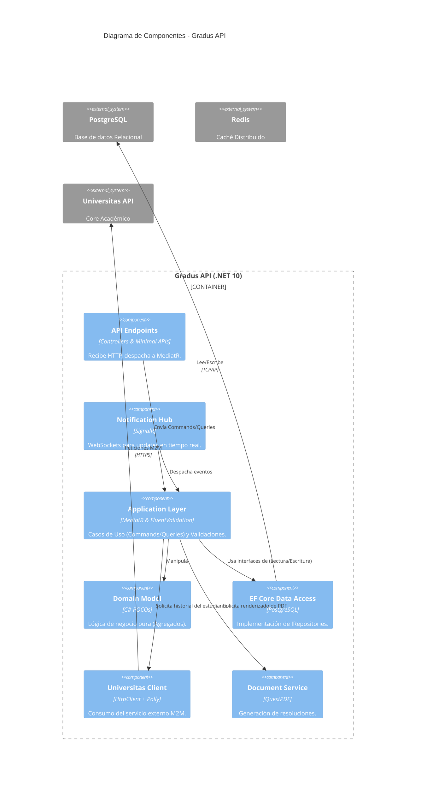

# Arquitectura y Diseño — Gradus API

## 🏛 1. Alineación con Clean Architecture

El proyecto exhibe una implementación rigurosa del patrón **Clean Architecture** (similar a *Onion Architecture* o *Hexagonal*), segregando las responsabilidades en 4 capas:

*   **🟢 `Gradus.Domain`:** Es el núcleo absoluto. No tiene dependencias externas (`.csproj` limpio) y contiene *Rich Domain Models* (Agregados como `HomologationRequest` con estado encapsulado) e Interfaces de persistencia (`IHomologationRepository`). **(Cumplimiento: Excelente)**.
*   **🔵 `Gradus.Application`:** Orquesta los casos de uso. Depende únicamente de `Gradus.Domain`. Implementa el patrón CQRS utilizando `MediatR`. Aquí residen los *Commands*, *Queries* y validaciones con `FluentValidation`. **(Cumplimiento: Excelente)**.
*   **🟡 `Gradus.Infrastructure`:** Implementa los detalles técnicos (Base de datos, HTTP Clients, PDF generation). Depende de `Domain` y `Application`. **(Cumplimiento: Excelente)**.
*   **🔴 `Gradus.API` (Composition Root):** Actúa como puerto de entrada (Controllers, SignalR Hubs) e inyecta las dependencias. Depende del resto de capas.

> **Veredicto de Capas:** Excelente separación. Las reglas de dependencia se respetan, lo que facilita el testing unitario en las capas internas sin requerir mocks complejos de infraestructura.

---

## 🧩 2. Cumplimiento de Principios SOLID

| Principio | Estado | Observaciones y Ejemplos del Código |
| :--- | :---: | :--- |
| **SRP** (Single Responsibility) | 🟡 | Los Agregados y Casos de Uso lo respetan. Sin embargo, **`Program.cs`** viola SRP al registrar Auth, Swagger, Cors, SignalR, Migraciones de BD, Seeds y Minimal APIs estáticas en un solo bloque monolítico de 170 líneas. <br><br>💡 *Refactor:* Mover extensiones a un `StartupExtensions.cs` (ej: `services.AddSwaggerDocs()`). |
| **OCP** (Open/Closed) | 🟢 | El uso de `MediatR` permite añadir nuevos casos de uso (nuevos Commands/Handlers) sin modificar controladores existentes ni inyectar N dependencias en el constructor del API. |
| **LSP** (Liskov Substitution) | 🟢 | El diseño por interfaces (ej. `IUniversitasClient`, `INotificationRepository`) asegura que la implementación real (`UniversitasClient` o un Mock) pueda ser sustituida sin que `Application` lo note. |
| **ISP** (Interface Segregation) | 🟢 | Las interfaces son pequeñas y orientadas al cliente. `IHomologationRepository` gestiona solo lo relativo al agregado raíz, delegando las notificaciones a `INotificationRepository`. |
| **DIP** (Dependency Inversion) | 🟢 | Inversión de dependencias de manual. `Gradus.Application` **no** depende de Entity Framework ni de `UniversitasClient`; depende de abstracciones definidas en `Domain` o en sí misma (`IUniversitasClient`). |

---

## 🛠 3. Patrones de Diseño Detectados

1.  **CQRS + Mediator (`MediatR`)**: Separa claramente las operaciones de lectura (Queries) de las de escritura (Commands) en la capa de Aplicación. El controlador `HomologationController` actúa como un simple despachador (*Thin Controller*).
2.  **Rich Domain Model (Aggregate Root)**: La entidad `HomologationRequest` no tiene *setters* públicos (`public string StudentNotes { get; private set; }`). Todo cambio de estado ocurre vía métodos de negocio (ej. `Submit()`, `Approve()`, `Reject()`), garantizando invariantes.
3.  **Options Pattern**: Uso correcto de `IOptions<UniversitasOptions>` en Infraestructura para fuertemente tipar las configuraciones del `appsettings.json`.
4.  **Resilience Pipeline (Polly)**: El cliente HTTP de Universitas se registra con `.AddStandardResilienceHandler()`, implementando un patrón de *Circuit Breaker* y *Retry* nativo en .NET.

---

## 🗺 4. Diagrama de Componentes (C4 Nivel 2)



---

## 📦 5. Mapeo Exhaustivo de Paquetes NuGet

| Paquete | Versión | Propósito en el Proyecto | ¿Necesario? / Crítica |
| :--- | :--- | :--- | :--- |
| `FluentValidation.AspNetCore` | 11.3.1 | (API) Binding de validaciones auto en MVC. | 🟡 **Redundante.** En CQRS, la validación debe ocurrir en el *Pipeline Behavior* de MediatR (detectado en Application), no en el middleware de ASP.NET. |
| `MediatR` | 14.1.0 | Enrutamiento de CQRS. | 🟢 Crítico para la arquitectura. |
| `Microsoft.EntityFrameworkCore` | 10.0.6 | ORM Principal. | 🟢 Crítico. |
| `Npgsql.EntityFrameworkCore.PostgreSQL` | 10.0.1 | Provider de DB. | 🟢 Crítico. |
| `Microsoft.Extensions.Http.Resilience` | 10.5.0 | Resiliencia HTTP (reemplazo de Polly directo). | 🟢 Excelente práctica para M2M. |
| `QuestPDF` | 2026.2.4 | Generación de reportes PDF. | 🟢 Rápido y moderno. *Ojo: requiere setear licencia Community (ya está hecho).* |
| `Serilog.AspNetCore` | 10.0.0 | Logging estructurado. | 🟢 Crítico para observabilidad. |

---

## 🔍 6. Análisis de `Program.cs` / Pipeline de Middlewares

El archivo `Program.cs` funge como *Composition Root*. 

### Aspectos Positivos
*   **Orden del Pipeline:** Se respeta el orden sagrado de seguridad en ASP.NET Core: `app.UseCors()` -> `app.UseAuthentication()` -> `app.UseAuthorization()`.
*   **CORS:** Definición explícita de `WithOrigins` permitiendo credenciales para el Frontend (Next.js en puertos 3003 y 3004).

### 🚨 Antipatrones / Zonas de Riesgo
1.  **Migraciones Automáticas en Producción:**
    ```csharp
    await db.Database.MigrateAsync();
    await seeder.SeedAsync();
    ```
    Aunque está envuelto en `if (app.Environment.IsDevelopment())`, **es una bomba de tiempo** si alguien lo quita o el ambiente no se detecta correctamente. En clusters de Kubernetes, si varios pods arrancan al mismo tiempo, generarán *Race Conditions* en la base de datos bloqueando tablas temporalmente. **Solución:** Mover migraciones a un job de CI/CD (Helm hook o init-container).
    
2.  **Configuración de DI (Dependency Injection) Lifetimes:**
    Se inyectó `DataSeeder` y repositorios como `Scoped`. Esto es correcto para aplicaciones Web. Sin embargo, no hay evidencia de validación de scopes estrictos para dependencias Singleton que puedan capturar accidentalmente Scoped services (*Captive Dependencies*).
    
3.  **Identidad Dividida (Mezcla de Patrones de API):**
    El archivo usa `app.MapControllers()` pero al final inyecta lógica extensa de Minimal APIs (ej. descarga de documentos `/documents/{fileName}` e integración de pruebas). Esto fragmenta la canalización; por ejemplo, filtros de acción globales (`ActionFilters`) no aplicarán a los Minimal APIs. 

> **Recomendación Estratégica:** Aislar la configuración de servicios en métodos de extensión estáticos (`AddSwaggerConfiguration()`, `AddAuthConfiguration()`) y unificar el estilo de los endpoints a una sola estrategia (preferiblemente mantener Minimal APIs para endpoints simples como HealthChecks, pero mover el resto de lógica a Controladores por consistencia).
