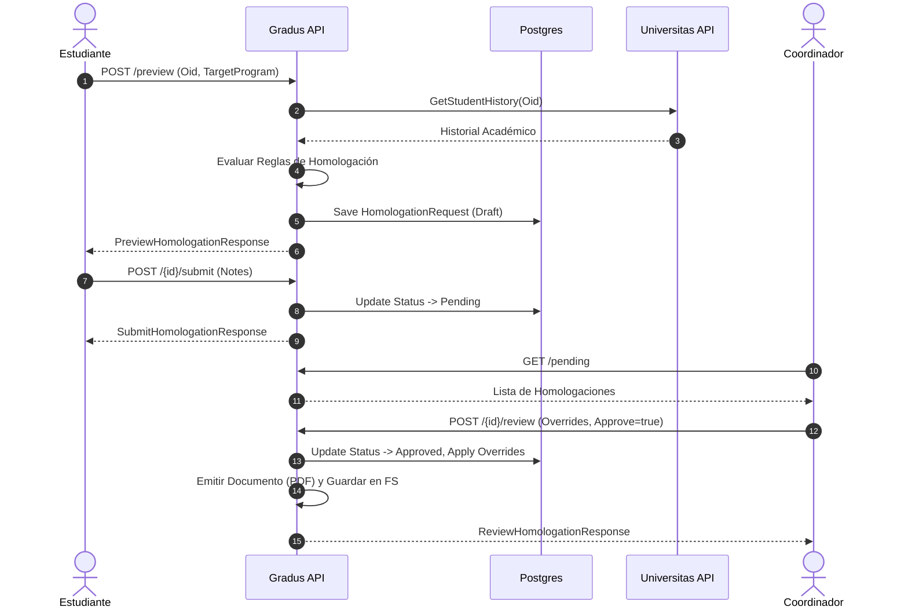
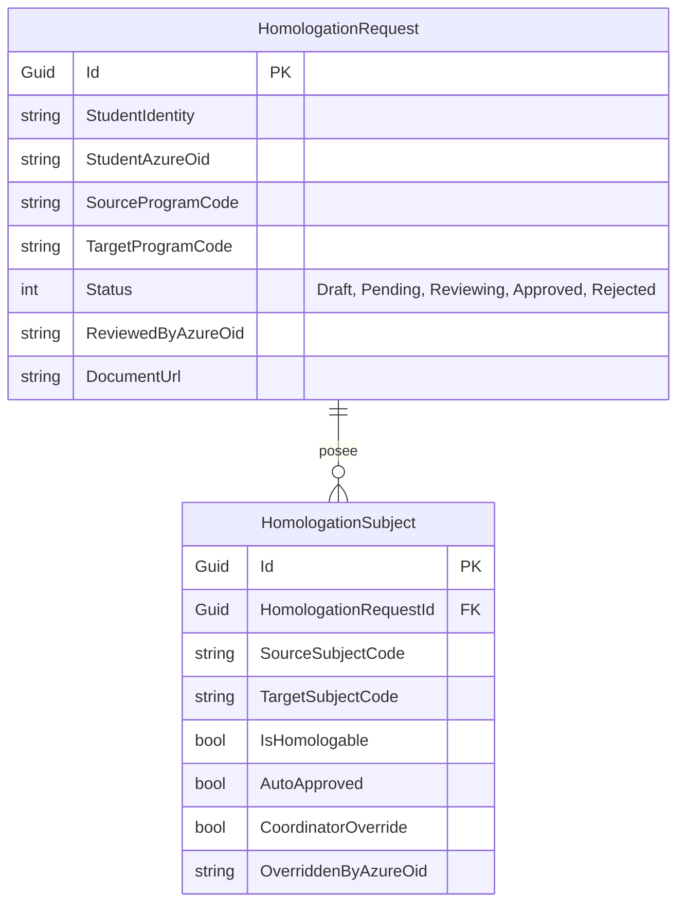

# Documentación y Modelo de Negocio — Gradus API

## 🎯 Propósito Funcional
El sistema "Gradus" orquesta y automatiza el **proceso de homologación académica** de los estudiantes del Politécnico Internacional. 
Actúa como puente entre el historial académico del estudiante (obtenido desde un sistema externo "Universitas") y el pénsum del nuevo programa al que el estudiante desea transicionar. Permite generar previas de homologación, someterlas a escrutinio de coordinadores académicos, aplicar excepciones manuales y emitir una resolución oficial.

---

## 🗂 Casos de Uso por Módulo

### 1. Módulo de Homologación (`HomologationController`)
*   **Vista Previa (Preview):** El estudiante simula un cambio de programa. El sistema cruza su historial con el programa destino usando reglas de negocio y muestra qué materias serían homologadas automáticamente.
*   **Sometimiento (Submit):** El estudiante acepta la vista previa y crea formalmente la solicitud, la cual queda en estado `Pending`.
*   **Revisión (Review):** Un coordinador evalúa la solicitud, pudiendo aplicar "excepciones manuales" (Overrides) a la evaluación automática (ej. aprobar una materia rechazada o rechazar una aprobada por contexto histórico).
*   **Consulta:** Recuperación de solicitudes (todas, pendientes o detalle completo) según el rol (estudiante o coordinador).

### 2. Módulo de Notificaciones (`NotificationsController` + `SignalR`)
*   **Notificaciones Asíncronas:** Informar en tiempo real (vía SignalR) y persistente (vía API) a estudiantes o coordinadores cuando el estado de una homologación cambia.

---

## 🔌 Inventario Exhaustivo de Endpoints

> ⚠️ **ZONA GRIS (Autenticación):** Actualmente **TODOS** los endpoints en los controladores tienen explícitamente el atributo `[AllowAnonymous]`, con comentarios que sugieren la adición de `[Authorize(Roles="...")]` en producción. Se asume en este inventario el comportamiento esperado para Producción.

### Homologaciones (`/api/homologations`)

| Método | Ruta | Auth Requerida (Esperado) | Request (Body/Query) | Response | Status Codes |
| :--- | :--- | :--- | :--- | :--- | :--- |
| `POST` | `/preview` | `Rol: estudiante` | **DTO:** `PreviewRequest` { `StudentAzureOid`, `TargetProgramCode` } | **DTO:** `PreviewHomologationResponse` | 200, 400, 409 |
| `POST` | `/{draftId:guid}/submit` | `Rol: estudiante` | **DTO:** `SubmitRequest` { `StudentAzureOid`, `StudentNotes` } | **DTO:** `SubmitHomologationResponse` | 200, 404, 409 |
| `POST` | `/{requestId:guid}/review` | `Rol: coordinador` | **DTO:** `ReviewRequest` { `CoordinatorAzureOid`, `Approve`, `CoordinatorNotes`, `SubjectOverrides` } | **DTO:** `ReviewHomologationResponse` | 200, 404, 409 |
| `GET`  | `/my` | `Rol: estudiante` | **Query:** `studentAzureOid` | `IReadOnlyList<RequestSummaryDto>` | 200 |
| `GET`  | `/pending` | `Rol: coordinador` | Ninguno | `IReadOnlyList<PendingRequestDto>` | 200 |
| `GET`  | `/{requestId:guid}` | `Autenticado` | **Query:** `callerAzureOid`, `isCoordinator` | `RequestDetailDto` | 200, 403, 404 |

### Notificaciones (`/api/notifications`)

| Método | Ruta | Auth Requerida (Esperado) | Request (Body/Query) | Response | Status Codes |
| :--- | :--- | :--- | :--- | :--- | :--- |
| `GET`  | `/unread` | `Autenticado` | **Query:** `azureOid` | Lista anónima de Notificaciones | 200 |
| `GET`  | `/` | `Autenticado` | **Query:** `azureOid`, `page`, `pageSize` | Lista anónima de Notificaciones | 200 |
| `PATCH`| `/{notificationId:guid}/read` | `Autenticado` | Ninguno | Vacío | 204 |
| `PATCH`| `/read-all` | `Autenticado` | **Query:** `azureOid` | Vacío | 204 |

### Core & Minimal APIs estáticas (`Program.cs`)

| Método | Ruta | Auth Requerida | Propósito | Status Codes |
| :--- | :--- | :--- | :--- | :--- |
| `GET` | `/health` | Ninguna | Liveness probe del contenedor. | 200 |
| `GET` | `/documents/{fileName}` | Ninguna (⚠️) | Sirve archivos físicos estáticos (PDFs). | 200, 404 |
| `GET` | `/test/universitas/{identity}`| Ninguna | Fetch crudo del sistema Universitas (M2M). Solo Dev. | 200 |

---

## 🌊 Flujos de Datos (Request → Response)

### Flujo de Sometimiento y Revisión (Happy Path)



---

## 🗃 Modelo de Datos (Core Domain)



---

## ⚙️ Configuración del Sistema (`appsettings.json`)

El entorno depende fuertemente de variables inyectadas y servicios subyacentes:

1.  **Base de Datos & Caché**:
    *   `ConnectionStrings:GradusDb`: Cadena cruda a PostgreSQL (puerto `5432`).
    *   `ConnectionStrings:Redis`: Conexión a nodo Redis (`localhost:6379`) para caché.
2.  **M2M Universitas (Servicio Externo)**:
    *   `Universitas:BaseUrl`: URL del microservicio fuente de la verdad académica (`http://localhost:3003`).
    *   Requiere credenciales Cliente OAuth (`TenantId`, `ClientId`, `ClientSecret`) para negociar tokens M2M.
3.  **Identidad (Azure AD)**:
    *   `AzureAd:TenantId` & `AzureAd:ClientId`: Parámetros para validar JWTs de usuarios en la configuración `AddJwtBearer`.

> ⚠️ **ZONA GRIS (Manejo de Secretos):** En `appsettings.json` se evidencian credenciales crudas (`ClientSecret: wQ68Q~...`) y keys de licencia de MediatR (`MediatR:LicenseKey`). Esto es un riesgo severo de seguridad; en producción se asume inyección mediante Azure Key Vault, AWS Secrets Manager o variables de entorno.

---

## 🚀 Levantamiento Local Paso a Paso

Para ejecutar la aplicación localmente por primera vez como desarrollador:

1.  **Requisitos Previos:**
    *   .NET 10.0 SDK instalado.
    *   Servidor PostgreSQL local o en Docker (puerto `5432` con usuario `postgres` y clave `secret`).
    *   Servidor Redis local o en Docker (puerto `6379`).
2.  **Restaurar Dependencias:**
    ```bash
    cd apps/Gradus/Gradus.API
    dotnet restore
    ```
3.  **Configurar Almacenamiento Estático:**
    *   Crea una carpeta llamada `documents` en la raíz de `Gradus.API` (necesaria para no generar error al solicitar PDFs).
4.  **Base de Datos y Migraciones:**
    *   El código en `Program.cs` incluye: `await db.Database.MigrateAsync();` y `await seeder.SeedAsync();` en modo Development.
    *   **No** necesitas correr `dotnet ef database update` manualmente a menos que modifiques el contexto; al ejecutar el proyecto, se crearán las tablas y el seeder inyectará datos de prueba.
5.  **Ejecutar:**
    ```bash
    ASPNETCORE_ENVIRONMENT=Development dotnet run
    ```
6.  **Validar:**
    *   Abre el navegador en la ruta que asigne kestrel (`http://localhost:<puerto>/swagger`).
    *   Verifica liveness ping: `GET http://localhost:<puerto>/health` (debe devolver `{"status":"healthy"}`).
